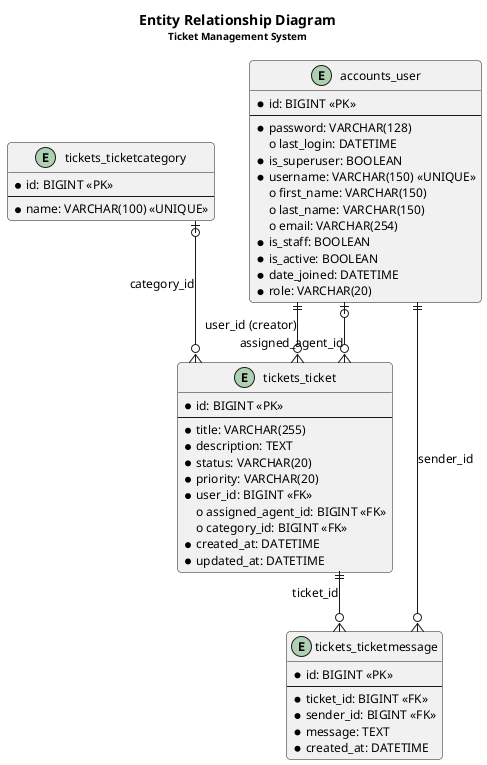
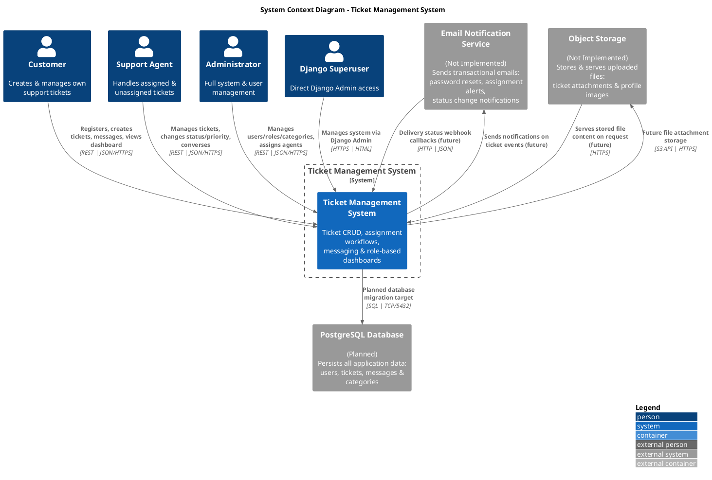
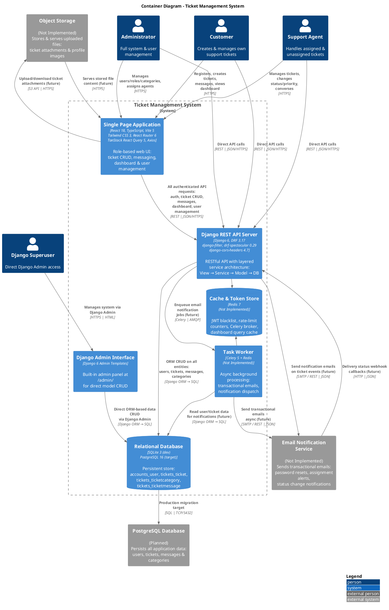

# سامانه مدیریت تیکت — مستندات معماری

---

## فهرست مطالب

- [۱. Entity Relationship Diagram (ERD)](#1-entity-relationship-diagram-erd)
- [۲. C4 سطح ۱ — دیاگرام بافت سیستم (System Context)](#2-c4-سطح-۱--دیاگرام-بافت-سیستم-system-context)
- [۳. C4 سطح ۲ — دیاگرام کانتینر (Container Diagram)](#3-c4-سطح-۲--دیاگرام-کانتینر-container-diagram)
- [۴. تصمیمات معماری](#4-تصمیمات-معماری)
- [۵. مراجع و فایل‌های مرتبط](#5-مراجع-و-فایلهای-مرتبط)

---

## 1. Entity Relationship Diagram (ERD)

![ERD - Ticket Management System](https://www.plantuml.com/plantuml/png/jLTHRzf847xdLupIX-AeKG8fLOKegWFcWWea1NEwXvFGOYzc6xDhxIvDQHFfTF-ZBttklxX_qbzoisiRJ0YNavBu9V7C-ljcPxwPNTuhJQHUBcBmXks9pu8hglk4auWkADUZbT9qKNe9xnxt80AasB01XnGT_ldnw--Vl_xw3XxNJAzWI6EYcU1gpX9eCn99ie0oXkSOc87GrWjGXvOKroyLT8JGKBwC2TVZVizvWd1BwehnX1ZYc76gLma58VLS51ngJa9npNW4Cn8hMl18iUHX82Id4juMx26TaMMiEuBh0LbGEAVnPwfPGEvVCs9VALIg1ITD4_Ij1716Wgl84hL4B2Iyw9nqtdGwnYDaI6LchTRUd7fdQ3M0cQtYdRgrJcPBIKxpDxsAAKn579PkIoKamxV6jFaVXMaSJvj_yeP2c7hbfBclo8rZiw9PUcHjZ0184E2sjPei5UPtevxMKccnWB6nzaL8OxFO-w8f3nMqFn4U2N2dIaiIQBleckav4AmMRdB6AExvaS5bvJdOYl00Y08RgYdR8R2m3cVTtxe37ngDom_D9bgFZgmh8KfTO_NgyBixR9sxmtAb-jP1bu2OA3s9HSHu7Tgkx_dTlfV2gObQ9bGQ1WI-kEXvxi1wZ8MZp0fejHC7ISU3xiUnPua5RbmYykww3UiU7rqG5c_irTfhPnsG9hFPTZ1enRIpptJR719D9vy4jbXuPr-cAWLq9Brz2l5egqyrIVy6I1y9kIgeA1DmA_KmgfvA5FSpMtMimtXG8NTgSR9TpsV8K24pesMIu0pCCcJo0YqXQJwKR3TXvVLI7IUIOUxG6BCP3LP1J9ydYpPxMQ0FvivEiw9WQwbWGwe2oH8psEhWUt_urfhkP5k1jaUphUrwJBzDjlWx7x8cmxvc4MfyWaEHwpsBSXNSwpw4G59SW13wJgSiat3NyGnIM52bCFw28lgfHG6UnYJJnVCKEkEszSxZ-1y5Dv_kIQV2Os5FlGvpYe8Sxit-aoHvwFLSltin69rtBqS0vUAT9h_hu9N6BBsv0NW7z0jEqdY5ISTQfC-DC8wlL0gyfHY7MIs-5OqBqwhfSsjXpEUPFKLt4V_e2BywGtVJlCynsrlVe-SOBnWmfR7W4RQUs8h6VMmwyFkAavxWQS9LFe-XFBZmOJ3kzLv1onsrtBRdbEofcWMTJO4w76Hz26KB8QHpO72h6MxUYaP9jXlD9ZOabc3a-HFpNyuWxZ3ijBDbECqObBrmzFDkUIZmNCw8kzQanNljvAVG2inDBr7xuroV83kn5gQAHQqvEKg0zpt2-0EXPaYxmQwx2s7VO-3u4wBqBm00)

### Description

ERD designed using PlantUML with Crow's Foot notation. The diagram covers all 4 custom entities:

| Table | Django Model | Description |
|-------|-------------|-------------|
| `accounts_user` | `accounts.models.User` | Custom user model with role field |
| `tickets_ticketcategory` | `tickets.models.TicketCategory` | Ticket category groupings |
| `tickets_ticket` | `tickets.models.Ticket` | Support tickets with status/priority lifecycle |
| `tickets_ticketmessage` | `tickets.models.TicketMessage` | Messages attached to tickets |

**Foreign Key Relationships:**

| FK | Source | Target | Nullable | On Delete |
|----|--------|--------|----------|-----------|
| `user_id` | `ticket` | `user` | NOT NULL | CASCADE |
| `assigned_agent_id` | `ticket` | `user` | NULL | SET_NULL |
| `category_id` | `ticket` | `category` | NULL | SET_NULL |
| `ticket_id` | `message` | `ticket` | NOT NULL | CASCADE |
| `sender_id` | `message` | `user` | NOT NULL | CASCADE |

**Note:** There is no Many-to-Many (M:N) relationship among the custom entities. The M:N relationships between `User ↔ Group` and `User ↔ Permission` belong to Django's built-in auth tables and are outside the scope of this ERD.

<b>View PlantUML Source — docs/erd.puml</b>

---

## 2. C4 سطح ۱ — دیاگرام بافت سیستم (System Context)

![C4 Level 1 - System Context Diagram](https://www.plantuml.com/plantuml/png/VLNDJXin4BxlKqmvj8aK5AdGIrKXQ18A5OIK3Qeg8KNExh2uUEsjxKr0fLBLz-Ybvxv5tuGdwOpNWOG_BfjTptpppNpVc6tdXVLrgI2zSXxBdj4UBttoGkfCrJd2kzvcjxSvYT-t7ZqGKgFTIfA3dIz79-F9v_tntkHWy64mxBVQIUAbLnZX8U90Nuh2YXBMOIop2_HmABGei4JjOsYIZD0werjPxRmfqNPWhHT_hl5lYyAZWvTGXbG7Pgx1rLLbh0SVKDrQUu524TfJMXe3TlYTSVQ4pXLb2-TaeJ4dm5hVlZp4oKkfAMs7dz9vAxm9V7PhfS0rNHA4Gnk9SKzt-KGGBPzIIl-hq8M1TF69OVhIOaRpQOv25H1PXeuv9Cre9kzDhNDXhrg-T9Jpr0ZNsl0z0VfhNZbwqZ1yBkdkh7Tyqk_4mOI8kR4NPyhCNUUKFZWd2gaBwjOQXUjJuMXWkN3dKoDipdn_t38UNFeMba8gGX_m4uR6opEP2I-DXXJjJ6R8jLjq0FjbfG8fpDkdEaMTEw1HQoSoZXSA0fXxUwehuaUySh3eIAaLlaAXzKoMNEvh1zavJHL1BvLccaiSgu8eZ8ppXSNqqm7qXHVSM60sKaBhm8Z59F79DIIwg2grQ2IdU2B5QXALw9uEDCCARgL0B8oLUA-osw0IHzElh7vAdgBmfyP1fm6AYipeHrqf8tAQ_Paa8rFrfYm8xqLspcaSN5d3vo1B9i9cEaQrj5mhvZZ6WjeBFMHnpnxqqe6PnBcxKvpf7W_ICLp3n_HesDqRZqSf5U8wSVrMYXp6lRr5RkHnqAZLhQoaEVahEZ1wHcI8zdCbciryj4JGeyisTTqx0HPU8HcPthFeItlxQ8Mu-JCfLdOtt30CGvXxuyE3nToNCHPxqTXynPn0befguYm8sJghVMsnpS2HsZ9Muz_6fy6CR5ue9LssmPzqsnSOxZrszpMCUwFkcysDruz01KFkXch1MKj-8eLk3PfkmCveFxJNJ2jv1V_-tFpyVVFhx-89GvpJVXAKxfhQJ_dw0invRYqIc--od8mPJTumLQQGMVi1LA0P9xOYH1-L99DSHVV07AVdnbpGlYar5Td5wkYOR9Hv8V36FS2qsIvkDUuM-z1p-qJFuhSQdNy06YQmJKhI_zJaFm00)

### شرح

این دیاگرام بافت کلی سیستم مدیریت تیکت را نشان می‌دهد. چهار نقش کاربری (Customer, Support Agent, Administrator, Django Superuser) با سیستم اصلی در ارتباط هستند. سیستم با سه سرویس خارجی در تعامل است: سرویس ایمیل برای ارسال اعلان‌ها، پایگاه داده PostgreSQL برای ذخیره‌سازی تولید، و Object Storage برای فایل‌های پیوست.

<b>مشاهده کد منبع PlantUML — docs/c4-level1-context.puml</b>

---

## 3. C4 سطح ۲ — دیاگرام کانتینر (Container Diagram)

![C4 Level 2 - Container Diagram](https://www.plantuml.com/plantuml/png/xLhTRjj65hxNKvpwefMnSbJ7FscDRb55KZOAR5aHwMO32116v5XYJ0wrCqCxncQ1ODzYBmeiUjstw9laIVQScI55MbBNgPtOIQiRKXnovl0xvtpdP_Y3qapgB8cXdGhD8i5b9s9JoPBQ5v48uYpay5rxjzdU7HStVBzoYB_MtzTgXwsNnoV--4NFVpe-xFwjs-_KDsir7UcOBrO0jmHiWHy5Prp34HDioXCkD7YNIlEaLliA_dg37puEW-xGE-wtF81w5EBKKS1Yq2aSydCUm_RcJPSOSAbIKGyofTE4omPijDtf1frBpZHNy2KavkKKf1S2L3QVfrA3Dk-jDZRpMV0EeV4npztGelyqprCcmXYVPaf5Ky53d30JnP_bUS8a4lXOYuwHqfBfrCZp98jZK0PScaAX6f82zSNpA22ND8gFT5unCKt1oo_HD9r8ya236pAh00i2haY6Mr1Qz-z-TzXl7OBtqlExHnzCUTRCnjtNkiuJ5iNuQbqwGZ_LqIckfgDKWCVbUHHmUl4w3a0lcSS6C1vkZeJ7HQW08HQA1NG_YcWcKmSZCKSTNQGo1CaLQgZX56XidCLSugMHGE_JcO9WXcXo4AMb2SwIZFFf61qCnHYaIaybzvuVGeTfDc7AIZU8cH16Ab8aAXuj1XNEvlCuVvaGxqV1I9CeZhES1YIeEsEVNmBUoAUfZFYLrTKEBd4yUKMQzz2UyFPraE2ecGeNESUJR1wdB4H3FOtGY75rkommhLameyVevhbCQHoYX0Iv7KEozWEFZq_wdTRm9S2lFx_xzo_ltlwqddDknwGUfva8cRoiwmJHtLYtsiOc_BDM0_YA17lx4ygM7qj4sTu-02yIKyHcW8z3gwJEguzzx2FANWXQLtD6vBLQLBAL8KSNWUrl6k1VphaNo6YEvlnZf3diZOIFJdCHYH3QdWTeRFRkOPff166Vnj6oM73c1fvdN5x2NWDQhwDKcUdJc6-HCuHmmITmqbkOMdjuqicj7EL3hmkPcarI9iELHFX_TVBm8AU_OTVpeJNetRakRbMNR1ujoBzuHQ925mBio7u3EiCdiFDW-n52QgvjeHTh2XsXFDrISwGB5cGna_3rWuVV5ZS5gLHRCuwq81NiFdXaz8VBd6QnMUaYqZE8sIMNF4IAj1GCJ0Opj9P0PvAZSd-C-8M1_R_ltludv-d5XQCqn31H_EqylevYTmwgSQs7f2PFcPlt_kY7X1lFcU3nGXjN92xhoOtv79cQKX8QUvoXfhOeTfinCncICZJD_-P8dAOIGXlh4uCbkT5rGDmzG2UDcGk7UOowSmIlWsndKWydXgkMv2VCCEOINUr0FUJd56WNeNXx7-gOI4-vtgGxNGWcibSK4D5UCKV2kA3LsEPMBlgExR6HarL-mGNYowK15woleuYz0sXZZEL8SdvwneM9t1pgJp9oeSrRryWL90DQc_BWPHbiF0WZ1SWSIqa4ZJvxuSCaHiAF4SO6O1BBj-8eYVH861XD1jFcCOM1YSIPPONM_s7YWv7WEaZj7u3Fr1cyI2NEzE4GkbKMm7VC2D-IvARiiA3imL_0GBm6u9Qw505C4E6ff7o5KZ1AuZ50KkHSaT8YmENy5Ca1OxuEPWZmlsuZNplnkiC5ORUF-twhryTBm-vXo-yTzxsdlO5tqtLgAmpXXFBXKYWPjA1kSuZxPm7tzLX3oYmLmZOR7F8faI2vQk2AuRpe68cywcZ0EKPo1ONpcfhNzmSU6XRDwWfZE-MHAwMBuiLMJYglf9fp6M7zeYzn91MOhoWRxYeJsWgvEg4fYfeIiqZLN5H1AAUjsh2O8Z4gSwsofQ9KBgKUvVXyrtgwwwDHGAd5K4rbScMuBiLvn2he5U336tZg7nskqS4LVouIsBfBP-ZSTYpkltzVyIkNcI_U8y0QN-NvCyBop3lkDrTup-zuq7h9-pru2s6WrtVzdqK4k8kWG55WsOJksXm-jwEb0o9YQsSjwbXbUcRxVPYh6DGbnrn7QUeUqM2UF5SAUyFLHGnfB9NrwmrsIVKLRLiAl-z5p7qxMWOXbPfwwdXuP9G5c3PIKvBKgoFJ3bpNZ4HjbfgHYsAMfYhqWfNN6Xqk1Tq_zRXUJ-KORFJbw1wnTYqrwXmR3Ox4gg3yVhfPzYzR8jPFxsdPzJ6rCHvQlocgvnaFpg1Q3e_4eXw6l1p6Ei_XjwYktu3V7ZJtTnvzUsrLLEhWpqqX2rhAY-UkC6UsnAtilup4gtIYe0ogAwtVGEle-M0DecNybdddyqJKWUbQPomqmRVfWZHHX-qcLdQtAi2-7t-iXFWFHY66AWvpv0koG62pX8CcXCoOvMlB1hPFjigY2nHNqyPDKtgt4rUiKcpnVl0iVfdVx1vllbtmoTjBEMJaszYqArrnDjV06mayTLx9pytEQzaMl2D_04qePSdlut-VAAvb_ghWjwe3IiqWwfh-BjIg02qyhkXENF39B4tFJ85DVTcF1vuZ4_V-hkBdSNHEtE2-K73IKLPknQiQ3zLJl_t-PcTgQKV8sivhDrJQKBbhmwWO24MsnGSOCWqpOnYGH5DfFSpk_RXD8aUWUxix3zUr2SlTXUft5P-ExzoGiqpPRpuiEJ7VY3J3z4BGYUCezBRIDo8Ldzin7aDDmFLL_1LK2xHDUzzyd48TOjgYk_z8spR9JjwpzkodDMPdqNvOGxjYvbsMdDB0ymCoMfR4jVy1)

### کانتینرها

در این دیاگرام، سیستم مدیریت تیکت به ۶ کانتینر تفکیک شده است:

| # | کانتینر | وضعیت | پشته فناوری | مسئولیت |
|---|---------|-------|------------|---------|
| C1 | Single Page Application | موجود | React 18, TypeScript, Vite 5, Tailwind CSS 3, React Router 6, TanStack React Query 5, Axios | رابط کاربری تحت وب برای هر سه نقش |
| C2 | Django REST API Server | موجود | Django 6, DRF 3.17, django-filter, drf-spectacular 0.29, django-cors-headers 4.7 | هسته API با معماری لایه‌ای View → Service → Model → DB |
| C3 | Django Admin Interface | موجود | Django 6 Admin Templates | پنل مدیریتی در /admin/ برای CRUD مستقیم |
| C4 | Relational Database | SQLite / PostgreSQL | SQLite 3 (dev) / PostgreSQL 16 (target) | ذخیره‌سازی: accounts_user, tickets_ticket, tickets_ticketcategory, tickets_ticketmessage |
| C5 | Cache & Token Store | آینده | Redis 7 | JWT blacklist, rate-limit counters, Celery broker, dashboard cache |
| C6 | Task Worker | آینده | Celery 5 + Redis | پردازش ناهمگام ایمیل‌ها و اعلان‌ها |

### روابط

**کاربران به کانتینرها:**

| مبدأ | مقصد | برچسب | پروتکل |
|------|------|-------|--------|
| Customer | SPA | ثبت‌نام، ایجاد تیکت، پیام، داشبورد | HTTPS |
| Agent | SPA | مدیریت تیکت‌ها، تغییر وضعیت/اولویت | HTTPS |
| Admin | SPA | مدیریت کاربران/نقش‌ها/دسته‌ها | HTTPS |
| Superuser | Django Admin | مدیریت سیستم از طریق Django Admin | HTTPS \| HTML |
| Customer/Agent/Admin | REST API | تماس مستقیم API | REST \| JSON/HTTPS |

**کانتینرهای داخلی:**

| مبدأ | مقصد | برچسب | پروتکل |
|------|------|-------|--------|
| SPA | REST API | تمام درخواست‌های API | REST \| JSON/HTTPS |
| REST API | Database | ORM CRUD روی تمام موجودیت‌ها | Django ORM → SQL |
| Admin Panel | Database | CRUD از طریق Django Admin | Django ORM → SQL |
| REST API | Cache | بررسی JWT blacklist (آینده) | Redis \| TCP/6379 |
| REST API | Task Worker | ارسال job ایمیل (آینده) | Celery \| AMQP |
| Task Worker | Database | خواندن داده کاربر/تیکت (آینده) | Django ORM → SQL |
| Task Worker | Cache | مصرف صف از طریق Redis broker (آینده) | Celery → Redis \| TCP/6379 |

**سیستم به خارجی:**

| مبدأ | مقصد | برچسب | پروتکل |
|------|------|-------|--------|
| REST API | Email Service | ارسال ایمیل اعلان (آینده) | SMTP / REST \| JSON |
| Task Worker | Email Service | ارسال ایمیل تراکنشی (آینده) | SMTP / REST \| JSON |
| Email Service | REST API | Webhook بازخورد تحویل (آینده) | HTTP \| JSON |
| Database | PostgreSQL | هدف مهاجرت به تولید | SQL \| TCP/5432 |
| SPA | Object Storage | بارگذاری/دریافت پیوست (آینده) | S3 API \| HTTPS |
| Object Storage | SPA | سرویس محتوای ذخیره شده (آینده) | HTTPS |

<b>مشاهده کد منبع PlantUML — docs/c4-level2-container.puml</b>

---

## 4. تصمیمات معماری

### معماری کلی

این پروژه از الگوی **Monolithic Backend + Decoupled SPA Frontend** پیروی می‌کند:

- **بک‌اند:** یکپارچه (Monolithic) با معماری لایه‌ای سرویس (Layered Service Architecture)
- **فرانت‌اند:** SPA مستقل با React که از طریق REST API با بک‌اند ارتباط برقرار می‌کند
- **احراز هویت:** مبتنی بر Session (کوکی HttpOnly)

### تفکیک سطح ۲ به کانتینر

| کانتینر | دلیل |
|---------|------|
| Single Page Application | جداسازی لایه نمایش از منطق تجاری، امکان توسعه مستقل فرانت‌اند |
| Django REST API Server | هسته اصلی سیستم، مسئول تمام منطق تجاری و API |
| Django Admin Interface | ابزار مدیریت مستقیم داده برای پشتیبانی فنی |
| Relational Database | ذخیره‌سازی پایدار داده‌ها (SQLite توسعه / PostgreSQL تولید) |
| Cache & Token Store | (آینده) — حافظه نهان برای Dashboard و محدودیت نرخ |
| Task Worker | (آینده) — پردازش ناهمگام ایمیل‌ها |

### روابط برگشتی

در سطح ۱، دو یال برگشتی اضافه شده است:
- **سرویس ایمیل ← سیستم:** در معماری استاندارد، سرویس ایمیل از طریق Webhook وضعیت تحویل را اعلام می‌کند
- **Object Storage ← سیستم:** پاسخ به درخواست فایل

برای PostgreSQL یال برگشتی در نظر گرفته نشد، زیرا پایگاه‌داده به صورت استاندارد ارتباط یک‌طرفه دارد.

### عدم وجود رابطه M:N

در مدل‌های سفارشی پروژه هیچ رابطه چندبه‌چند (M:N) وجود ندارد. رابطه‌های `groups` و `user_permissions` از `AbstractUser` مربوط به جداول داخلی Django هستند.

---

## 5. مراجع و فایل‌های مرتبط

### فایل‌های PlantUML

| فایل | توضیح |
|------|-------|
| `docs/erd.puml` | ERD با نمادگذاری Crow's Foot — ۴ موجودیت، ۵ رابطه |
| `docs/c4-level1-context.puml` | C4 سطح ۱ — بافت سیستم |
| `docs/c4-level2-container.puml` | C4 سطح ۲ — کانتینر (۶ کانتینر) |

### نحوه رندر

برای مشاهده دیاگرام‌ها به صورت محلی، یکی از روش‌های زیر را استفاده کنید:

1. **VS Code:** افزونه `jebbs.plantuml` را نصب کنید و با `Alt+D` پیش‌نمایش بگیرید
2. **JetBrains (PyCharm):** پلاگین PlantUML را نصب کنید
3. **PlantUML Online:** فایل‌های `.puml` را در [plantuml.com](https://www.plantuml.com/plantuml/) بارگذاری کنید
4. **تصاویر رندر شده:** تصاویر PNG بالا از سرور رسمی PlantUML دریافت شده‌اند

> **توجه:** دیاگرام‌های C4 نیاز به کتابخانه `C4-PlantUML` دارند که سرور PlantUML آن را به صورت خودکار از مخزن رسمی بارگذاری می‌کند. اتصال اینترنت برای رندر این دیاگرام‌ها لازم است.

---

— پایان مستندات معماری —

