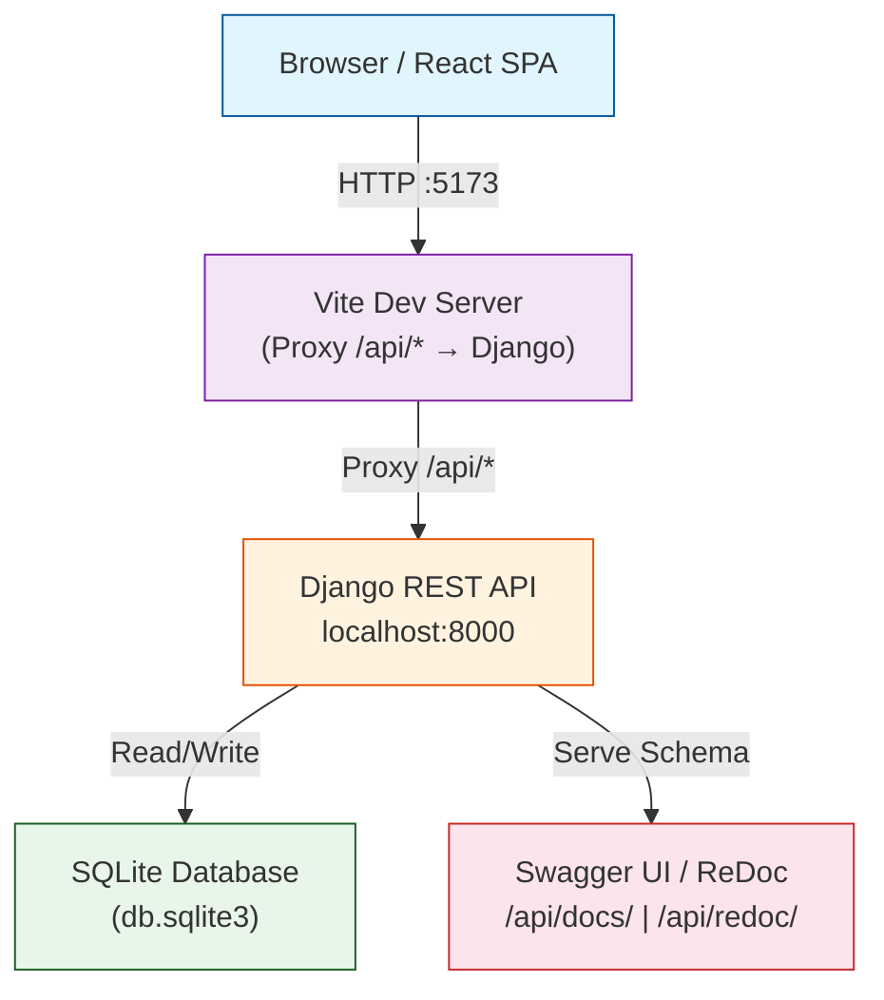
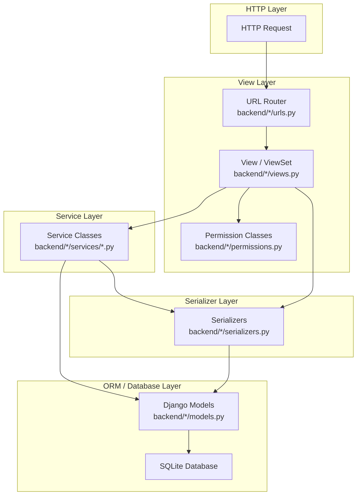
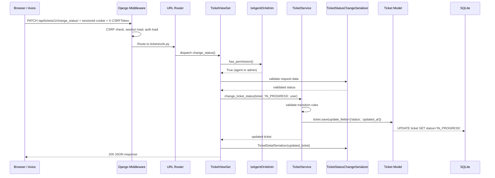
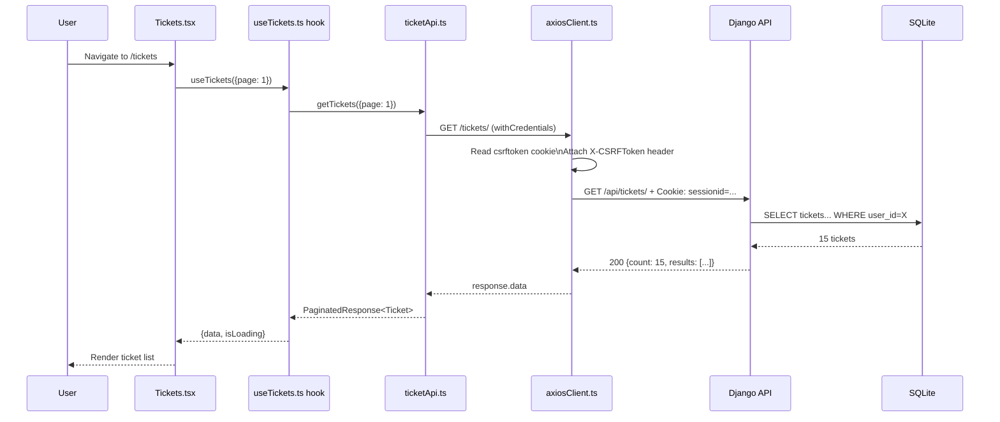

# Architecture

## High-Level System Architecture

The Ticket Management System is a full-stack web application with a React frontend and a Django REST API backend, communicating over HTTP. Session-based authentication and CSRF protection handle security.



### Frontend-to-Backend Communication

- The Vite development server proxies `/api/*` requests to the Django backend (default target `http://localhost:8000`).
- In production, a reverse proxy (e.g., Nginx) would serve the compiled frontend and forward API requests.
- The Axios client uses `withCredentials: true` so the `sessionid` cookie is sent automatically.
- CSRF protection is handled by reading the `csrftoken` cookie (non-HttpOnly) and sending its value as the `X-CSRFToken` header on state-changing requests.

## Backend Layered Architecture

The Django backend follows a **View → Service → Serializer → Model/ORM → Database** layered architecture:



### Layer Responsibilities

| Layer | Location | Responsibility |
|-------|----------|----------------|
| **View** | `backend/*/views.py` | HTTP handling, permission enforcement, request/response orchestration |
| **Service** | `backend/*/services/*.py` | Business logic, validation, data aggregation, transactional operations |
| **Serializer** | `backend/*/serializers.py` | Request deserialization, response serialization, field-level validation |
| **Model** | `backend/*/models.py` | Data schema, ORM relationships, indexes, constraints |
| **Permission** | `backend/accounts/permissions.py` and `backend/tickets/permissions.py` | Role-based and object-level access control |

### How Serializers Participate in Requests

1. The view receives a request and passes the data to a serializer via `serializer_class`.
2. The serializer validates the input using field-level and object-level `validate_*` methods.
3. For create/update actions, validated data is passed to the service layer.
4. For responses, serializers transform model instances into JSON (including nested user info via `UserMinimalSerializer`).

**Example** (`backend/tickets/views.py`):

```python
class TicketViewSet(viewsets.ModelViewSet):
    def get_serializer_class(self):
        if self.action == 'list':
            return TicketListSerializer      # Lightweight, truncated description
        if self.action == 'retrieve':
            return TicketDetailSerializer    # Full detail with nested messages
        if self.action == 'create':
            return TicketCreateSerializer    # Title, description, priority, category
```

### How Permission Classes Participate in Requests

1. **Global default**: `rest_framework.permissions.IsAuthenticated` — all views require authentication by default.
2. **View-level**: Each view or action overrides `get_permissions()` to return specific permission instances.
3. **Object-level**: Permissions like `CanModifyTicket` and `CanDeleteTicket` implement `has_object_permission()` for fine-grained access control.
4. **Role-based**: `IsAdmin`, `IsAgentOrAdmin` etc. from `backend/accounts/permissions.py` gate entire actions.

**Example** (`backend/tickets/views.py`):

```python
def get_permissions(self):
    if self.action == 'change_status':
        return [IsAgentOrAdmin()]
    if self.action == 'assign':
        return [IsAdmin()]
    if self.action in ['update', 'partial_update']:
        return [IsAuthenticated(), CanModifyTicket()]
    if self.action == 'destroy':
        return [IsAuthenticated(), CanDeleteTicket()]
```

## Backend Request Lifecycle

A typical authenticated API request (e.g., PATCH `/api/tickets/{id}/change_status/`) flows through these layers:



## Frontend-to-Backend Request Flow

Example: Loading the ticket list as a customer



## Key Files

| File | Purpose |
|------|---------|
| `backend/ticketProject/settings.py` | Django configuration (apps, middleware, auth, CORS, CSRF) |
| `backend/ticketProject/urls.py` | Root URL routing |
| `backend/ticketProject/exceptions.py` | Custom exception handler for consistent error responses |
| `backend/accounts/permissions.py` | Central role-based permission classes |
| `backend/tickets/permissions.py` | Object-level ticket and message permissions |
| `backend/accounts/services/user_service.py` | User business logic |
| `backend/tickets/services/ticket_service.py` | Ticket business logic |
| `backend/tickets/services/message_service.py` | Message business logic |
| `backend/dashboard/services/dashboard_service.py` | Dashboard aggregation logic |
| `frontend/src/api/axiosClient.ts` | Axios config with CSRF interceptor and retry logic |
| `frontend/src/context/AuthContext.tsx` | Authentication state management |
| `docker-compose.yml` | Docker Compose service definitions |

## Related Documents

- [C4 Model](c4-model.md) — visual architecture diagrams
- [Backend](backend.md) — detailed backend reference
- [Frontend](frontend.md) — detailed frontend reference
- [Database](database.md) — data model details
- [Authentication & RBAC](authentication-and-rbac.md) — authentication flow and roles
