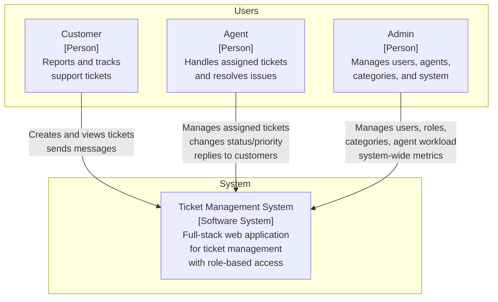
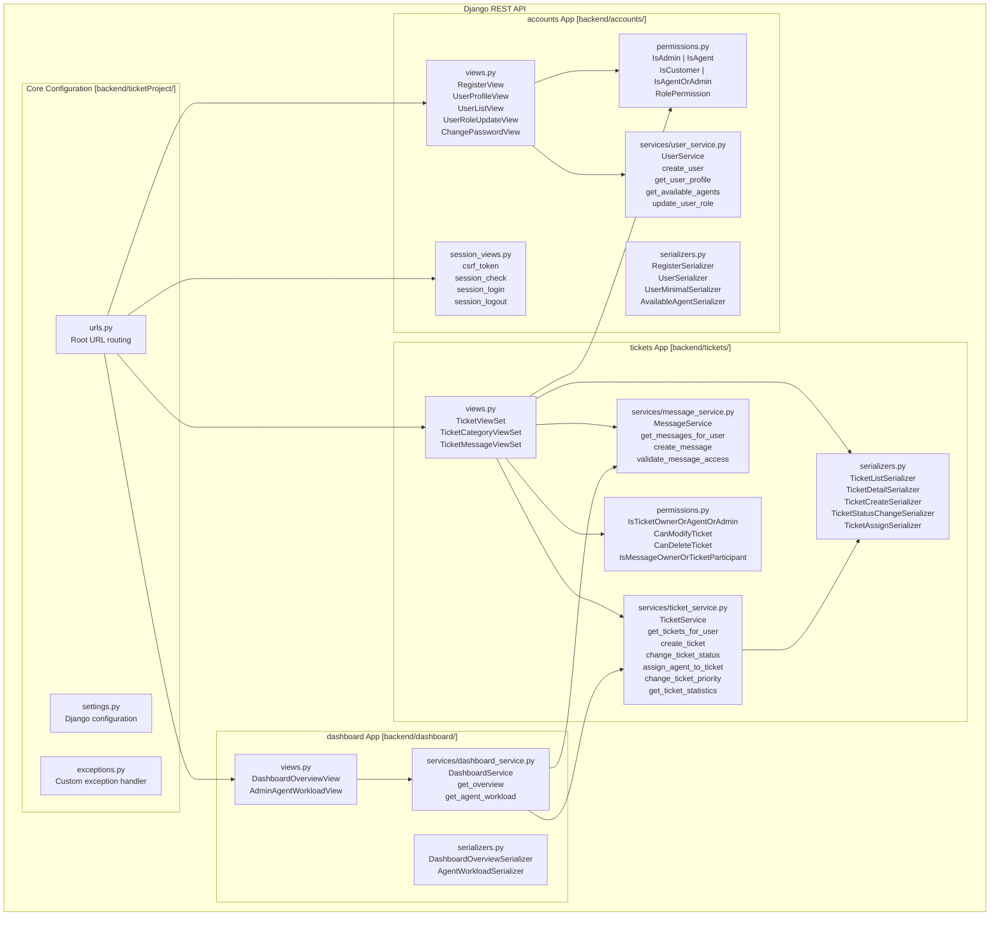
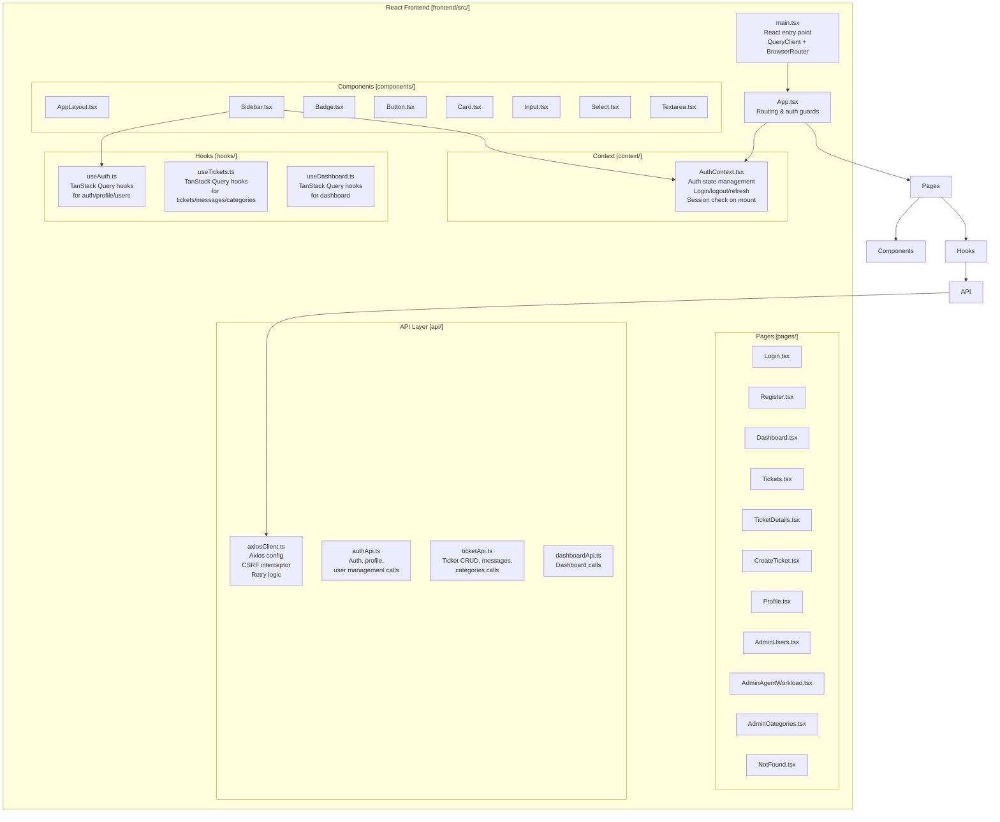
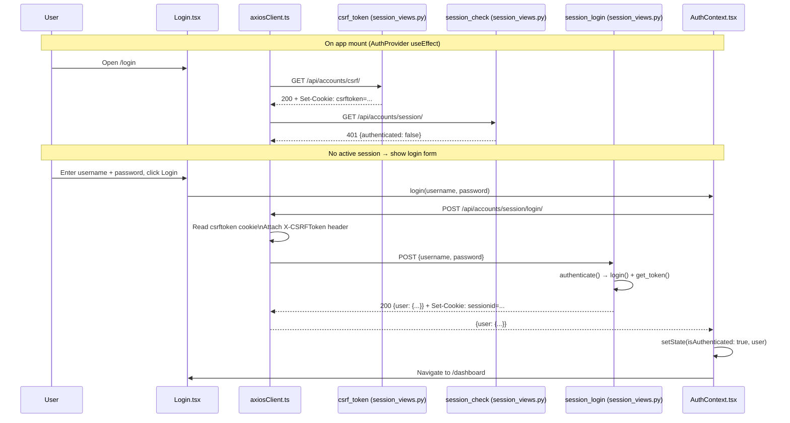
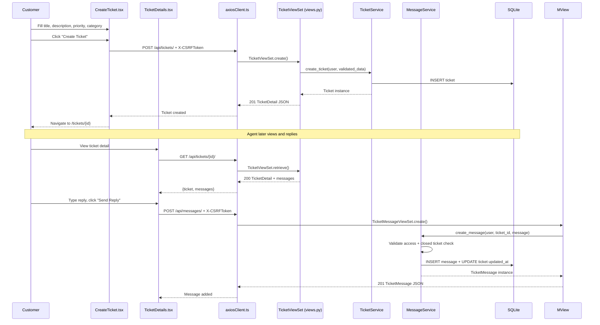

# C4 Model

## Introduction

This document describes the Ticket Management System using the **C4 model** for visualizing software architecture. Diagrams follow the C4 hierarchical approach:

1. **System Context** — the system and its users
2. **Container** — the high-level technical containers
3. **Component** — the major structural components inside each container

All diagram details are verified against the actual source code in this repository. Terminology is consistent with the [Architecture](architecture.md) and other documentation pages.

### Scope

The system is a **role-based ticket management application** with three user roles (Customer, Agent, Admin) that allows ticket creation, assignment, status tracking, and messaging.

### Assumptions and Constraints

- The application runs in a local development or single-server environment.
- SQLite is the database; no external database server is required.
- Session authentication requires browser cookie support; no JWT.
- No email, file upload, or real-time services are integrated.

---

## A. System Context Diagram



### Explanation

- **Customer**: Creates support tickets, views their own tickets, sends and receives messages. Can only see their own tickets.
- **Agent**: Views assigned and unassigned tickets, changes status and priority, replies to customer messages. Cannot see tickets assigned to other agents.
- **Admin**: Full access to all tickets, users, categories, and agent workload data. Manages role assignments and system configuration.
- **Ticket Management System**: The software system that provides all these capabilities through a web browser interface.

---

## B. Container Diagram

```mermaid
flowchart TD
    subgraph "Users"
        Actor["User (Browser)"]
    end

    subgraph "Ticket Management System"
        Frontend["React Frontend\n[Container: JavaScript/TypeScript]\nSPA with Vite dev server\nPort 5173"]
        
        Backend["Django REST API\n[Container: Python/Django]\nDRF API with session auth\nPort 8000"]

        DB[(SQLite Database\n[Container: SQLite]\nFile-based database\nbackend/db.sqlite3)]

        APIDocs["Swagger UI / ReDoc\n[Container: drf-spectacular]\nInteractive API docs\n/api/docs/ | /api/redoc/"]
    end

    Actor -->|"HTTP :5173"| Frontend
    Frontend -->|"HTTP /api/* proxy"| Backend
    Backend -->|"Django ORM"| DB
    Backend -->|"Serve OpenAPI schema"| APIDocs

    style Actor fill:#e1f5fe,stroke:#01579b
    style Frontend fill:#f3e5f5,stroke:#7b1fa2
    style Backend fill:#fff3e0,stroke:#e65100
    style DB fill:#e8f5e9,stroke:#1b5e20
    style APIDocs fill:#fce4ec,stroke:#c62828
```

### Container Responsibilities

| Container | Technology | Responsibility |
|-----------|-----------|----------------|
| **React Frontend** | React 18, TypeScript, Vite 5, TanStack Query 5, Tailwind CSS 3 | Single-page application providing the user interface. Routes, manages auth state, calls the API via Axios. |
| **Django REST API** | Django 6.0, DRF 3.17, Session Authentication | HTTP API server handling all business logic. Uses a View → Service → Model layered architecture. |
| **SQLite Database** | SQLite (via Django ORM) | Persistent storage for users, tickets, messages, and categories. File-based, no separate server. |
| **Swagger UI / ReDoc** | drf-spectacular 0.29.0 | Generated API documentation served by Django. Schema at `/api/schema/`, UI at `/api/docs/` and `/api/redoc/`. |

Docker Compose orchestrates the frontend and backend containers for local development (`backend/Dockerfile`, `frontend/Dockerfile`, `docker-compose.yml`).

---

## C. Component Diagram — Backend



### View → Service → Model Flow

- **TicketViewSet** delegates business logic to `TicketService` and `MessageService`.
- **User views** delegate to `UserService`.
- **Dashboard views** delegate to `DashboardService`, which internally uses `TicketService` and `MessageService` for data aggregation.
- Services interact directly with Django models (ORM) and return results to views, which then pass data through serializers for the HTTP response.

---

## D. Component Diagram — Frontend



### Frontend Communication with Backend

1. **AxiosClient** (`frontend/src/api/axiosClient.ts`) creates an Axios instance with `baseURL: '/api'` and `withCredentials: true`.
2. The **request interceptor** reads the `csrftoken` cookie and adds `X-CSRFToken` header on POST/PUT/PATCH/DELETE.
3. The **response interceptor** handles 401 (session expired → redirect to `/login`) and 403 CSRF errors (retry once with fresh token).
4. The **AuthContext** (`frontend/src/context/AuthContext.tsx`) calls `/api/accounts/csrf/` on mount, then checks the session via `/api/accounts/session/`.
5. All API calls go through Vite's proxy (`frontend/vite.config.ts`), forwarding `/api/*` to the Django backend.

---

## E. Dynamic Flow — User Login



## F. Dynamic Flow — Ticket Creation and Reply



---

## Related Documents

- [Architecture](architecture.md) — detailed system architecture
- [Backend](backend.md) — backend component reference
- [Frontend](frontend.md) — frontend component reference
- [Authentication & RBAC](authentication-and-rbac.md) — authentication flow details
- [Ticket Workflow](ticket-workflow.md) — ticket lifecycle
