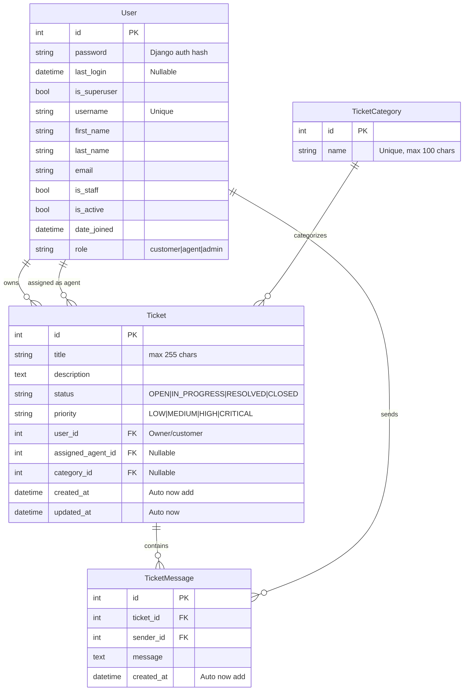

# Database

## Database Technology

The project uses **SQLite** via Django's default ORM backend (`django.db.backends.sqlite3`). The database file is stored at `backend/db.sqlite3`.

For production, PostgreSQL is recommended. See [Deployment](deployment.md) for migration guidance.

---

## Entity-Relationship Diagram

---

## Models

### User (`backend/accounts/models.py`)

Extends Django's `AbstractUser` with a custom `role` field.

| Field | Type | Constraints | Default | Description |
|-------|------|-------------|---------|-------------|
| `id` | BigAutoField | PK | Auto | Primary key |
| `password` | CharField | max_length=128 | Required | Django auth hash |
| `last_login` | DateTimeField | Nullable | — | Last login timestamp |
| `is_superuser` | BooleanField | — | False | Django superuser flag |
| `username` | CharField | max_length=150, unique | Required | Username |
| `first_name` | CharField | max_length=150 | '' | First name |
| `last_name` | CharField | max_length=150 | '' | Last name |
| `email` | EmailField | max_length=254 | '' | Email address |
| `is_staff` | BooleanField | — | False | Django staff flag |
| `is_active` | BooleanField | — | True | Active flag |
| `date_joined` | DateTimeField | — | Auto | Account creation date |
| `role` | CharField | max_length=20, choices | `'customer'` | Role: `customer`, `agent`, or `admin` |

**Role choices**:
- `customer` — end user who creates and tracks tickets
- `agent` — support agent who handles tickets
- `admin` — system administrator

**Meta**: `ordering = ['username']`

**Relationships**:
- `tickets` (reverse FK from `Ticket.user`) — tickets owned by this user
- `assigned_tickets` (reverse FK from `Ticket.assigned_agent`) — tickets assigned to this user as agent
- `ticketmessage_set` (reverse FK from `TicketMessage.sender`) — messages sent by this user

---

### Ticket (`backend/tickets/models.py`)

| Field | Type | Constraints | Default | Description |
|-------|------|-------------|---------|-------------|
| `id` | BigAutoField | PK | Auto | Primary key |
| `title` | CharField | max_length=255 | Required | Ticket title |
| `description` | TextField | — | Required | Detailed issue description |
| `status` | CharField | max_length=20, choices | `'OPEN'` | Status: `OPEN`, `IN_PROGRESS`, `RESOLVED`, `CLOSED` |
| `priority` | CharField | max_length=20, choices | `'MEDIUM'` | Priority: `LOW`, `MEDIUM`, `HIGH`, `CRITICAL` |
| `user` | ForeignKey → User | `on_delete=CASCADE`, `related_name='tickets'` | Required | Ticket owner/creator |
| `assigned_agent` | ForeignKey → User | `on_delete=SET_NULL`, `null=True`, `blank=True`, `related_name='assigned_tickets'` | Nullable | Agent assigned to handle this ticket |
| `category` | ForeignKey → TicketCategory | `on_delete=SET_NULL`, `null=True`, `blank=True` | Nullable | Category classification |
| `created_at` | DateTimeField | `auto_now_add=True` | Auto | Creation timestamp |
| `updated_at` | DateTimeField | `auto_now=True` | Auto | Last update timestamp |

**Status choices** (`Ticket.Status`):
- `OPEN` — ticket created, not yet being worked on
- `IN_PROGRESS` — being worked on by an agent
- `RESOLVED` — issue resolved, awaiting customer confirmation
- `CLOSED` — ticket closed (final state)

**Priority choices** (`Ticket.Priority`):
- `LOW`, `MEDIUM`, `HIGH`, `CRITICAL`

**Meta**:
- `ordering = ['-created_at']` — newest first
- **Indexes**:
  - `status` — for filtering by status
  - `priority` — for filtering by priority
  - `created_at` — for ordering and date-range queries

**Delete behavior**:
- If the owning `User` is deleted, all their tickets cascade-delete (`CASCADE`).
- If the `assigned_agent` User is deleted, the field is set to `NULL` (`SET_NULL`).
- If the related `TicketCategory` is deleted, the field is set to `NULL` (`SET_NULL`).

---

### TicketCategory (`backend/tickets/models.py`)

| Field | Type | Constraints | Default | Description |
|-------|------|-------------|---------|-------------|
| `id` | BigAutoField | PK | Auto | Primary key |
| `name` | CharField | max_length=100, `unique=True` | Required | Category display name |

**Meta**: `ordering = ['name']`

**Relationships**:
- `ticket_set` (reverse FK from `Ticket.category`) — tickets in this category

---

### TicketMessage (`backend/tickets/models.py`)

| Field | Type | Constraints | Default | Description |
|-------|------|-------------|---------|-------------|
| `id` | BigAutoField | PK | Auto | Primary key |
| `ticket` | ForeignKey → Ticket | `on_delete=CASCADE`, `related_name='messages'` | Required | Parent ticket |
| `sender` | ForeignKey → User | `on_delete=CASCADE` | Required | Message author |
| `message` | TextField | — | Required | Message content |
| `created_at` | DateTimeField | `auto_now_add=True` | Auto | Creation timestamp |

**Meta**: `ordering = ['created_at']` — chronological order

**Delete behavior**:
- If the parent `Ticket` is deleted, all its messages cascade-delete.
- If the `sender` User is deleted, their messages cascade-delete.

---

## Key Relationships

| Relationship | Type | Description |
|-------------|------|-------------|
| User → Ticket | One-to-Many | A customer owns multiple tickets (`ticket.user`). |
| User → Ticket (assigned) | One-to-Many | An agent can be assigned multiple tickets (`ticket.assigned_agent`). |
| Ticket → TicketCategory | Many-to-One | A ticket belongs to one category; a category can have many tickets. |
| Ticket → TicketMessage | One-to-Many | A ticket has multiple messages in a conversation thread. |
| User → TicketMessage | One-to-Many | A user sends multiple messages across tickets. |

## Notes

- The `User` model extends `AbstractUser` rather than using a `OneToOneField` profile model. The `role` field is the primary mechanism for RBAC.
- The `Ticket.assigned_agent` field uses `SET_NULL` on delete, preserving ticket history even if an agent's account is removed.
- `TicketMessage` is the only model with no `updated_at` field — messages are immutable after creation.
- No explicit `related_name` on `Ticket.category`; the default `ticket_set` is used for reverse lookups.

---

## Related Documents

- [Backend](backend.md) — model files and services
- [API Reference](api-reference.md) — endpoints that read/write these models
- [Authentication & RBAC](authentication-and-rbac.md) — role-based access rules
- [Ticket Workflow](ticket-workflow.md) — status transitions and lifecycle
