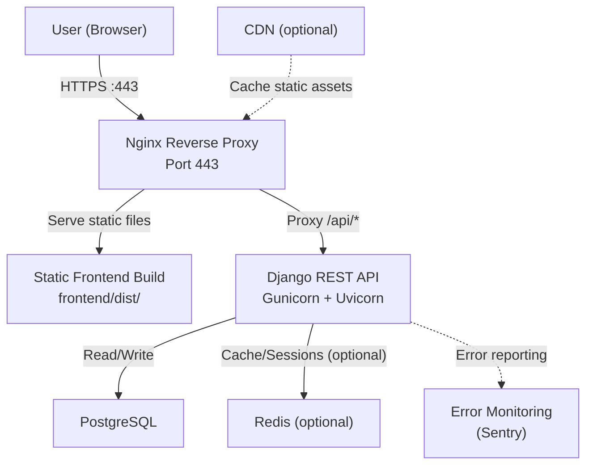

# Deployment

## Current Deployment Setup

The repository includes Docker Compose for local development. There is no production deployment configuration.

### What Currently Exists

#### Docker Images

- **Backend Dockerfile**: `backend/Dockerfile` — Python 3.12-slim image that copies the backend, installs dependencies, and runs `manage.py runserver 0.0.0.0:8000`.
- **Frontend Dockerfile**: `frontend/Dockerfile` — Node 20 image that installs dependencies and runs `npm run dev -- --host`.

#### Docker Compose

`docker-compose.yml` defines two services:

| Service | Image | Ports | Volumes | Command |
|---------|-------|-------|---------|---------|
| `backend` | Build from `./backend` | `8000:8000` | `./backend:/app` | `migrate && runserver 0.0.0.0:8000` |
| `frontend` | Build from `./frontend` | `5173:5173` | `./frontend:/app`, exclude `/app/node_modules` | `npm run dev -- --host` |

Features:
- `depends_on` with `condition: service_healthy` ensures the backend is ready before the frontend starts.
- A healthcheck pings `GET /api/accounts/csrf/` every 10 seconds.
- The frontend connects to the backend via `VITE_API_PROXY_TARGET=http://backend:8000`.

#### CI Pipeline

`.github/workflows/ci.yml` runs on every push/PR to `master`:
- Backend: migration check, system checks, tests
- Frontend: TypeScript check, production build

#### Django Production Settings

In `backend/ticketProject/settings.py`, security settings activate when `DEBUG = False`:

```python
if not DEBUG:
    SECURE_SSL_REDIRECT = True
    SESSION_COOKIE_SECURE = True
    CSRF_COOKIE_SECURE = True
    SECURE_BROWSER_XSS_FILTER = True
    SECURE_CONTENT_TYPE_NOSNIFF = True
    X_FRAME_OPTIONS = 'DENY'
    SECURE_HSTS_SECONDS = 31536000
    SECURE_HSTS_INCLUDE_SUBDOMAINS = True
    SECURE_HSTS_PRELOAD = True
```

---

## Recommended Production Architecture

> The following recommendations are **proposals**, not existing implementations. They describe what should be added for a production-ready deployment.



### Key Production Considerations

#### 1. PostgreSQL Migration

**What exists**: SQLite (`django.db.backends.sqlite3`)
**What to do**:
- Install and configure PostgreSQL
- Update `DATABASES` in `backend/ticketProject/settings.py`:
  ```python
  DATABASES = {
      'default': {
          'ENGINE': 'django.db.backends.postgresql',
          'NAME': os.environ.get('DB_NAME', 'ticket_system'),
          'USER': os.environ.get('DB_USER', ''),
          'PASSWORD': os.environ.get('DB_PASSWORD', ''),
          'HOST': os.environ.get('DB_HOST', 'localhost'),
          'PORT': os.environ.get('DB_PORT', '5432'),
      }
  }
  ```
- Use `pg_dump`/`pg_restore` or Django's `dumpdata`/`loaddata` to migrate data

#### 2. Application Server

**What exists**: `manage.py runserver` (Django dev server — not production-safe)
**What to do**:
- Use **Gunicorn** as the WSGI server
- Optionally use **Uvicorn** with **Daphne** for ASGI support (future WebSocket use)
- Example Gunicorn command:
  ```bash
  gunicorn ticketProject.wsgi:application --workers 4 --bind 0.0.0.0:8000
  ```

#### 3. Static Frontend Build

**What exists**: Vite dev server with `npm run dev`
**What to do**:
- Build the frontend for production: `npm run build`
- Serve the `dist/` directory from Nginx (not from Django)
- Configure Nginx to proxy `/api/` requests to the Django backend

Nginx configuration example:
```nginx
server {
    listen 443 ssl;
    server_name example.com;

    # Frontend static files
    root /var/www/ticket-system/frontend/dist;
    index index.html;

    # SPA routing — serve index.html for all non-API routes
    location / {
        try_files $uri $uri/ /index.html;
    }

    # API proxy
    location /api/ {
        proxy_pass http://backend:8000;
        proxy_set_header Host $host;
        proxy_set_header X-Real-IP $remote_addr;
        proxy_set_header X-Forwarded-For $proxy_add_x_forwarded_for;
        proxy_set_header X-Forwarded-Proto $scheme;
    }

    # Django Admin (if needed)
    location /admin/ {
        proxy_pass http://backend:8000;
    }
}
```

#### 4. HTTPS

- Use **Let's Encrypt** with Certbot for free TLS certificates.
- Configure `SECURE_SSL_REDIRECT = True` (already in production settings).
- Set `SESSION_COOKIE_SECURE = True` and `CSRF_COOKIE_SECURE = True` (already conditionally set).

#### 5. Allowed Hosts

**What exists**: Hardcoded list for development
**What to do**: Set `DJANGO_ALLOWED_HOSTS` environment variable with your domain(s):

```bash
DJANGO_ALLOWED_HOSTS=example.com,api.example.com
```

#### 6. CSRF Trusted Origins

**What exists**: Development origins for localhost:5173
**What to do**: Set `DJANGO_CSRF_TRUSTED_ORIGINS` environment variable:

```bash
DJANGO_CSRF_TRUSTED_ORIGINS=https://example.com
```

#### 7. Secret Management

**What exists**: Dev fallback secret key
**What to do**:
- Generate a strong secret key: `python -c "import secrets; print(secrets.token_urlsafe(50))"`
- Set `DJANGO_SECRET_KEY` environment variable
- Use a secrets manager (e.g., HashiCorp Vault, AWS Secrets Manager) for larger deployments
- Never commit secrets to version control

#### 8. Database Migrations

**What exists**: Manual migration in Docker Compose command
**What to do**:
- Automate migrations in the deployment pipeline
- Run `python manage.py migrate` as a one-time task before starting new application instances
- Consider using a migration tool like `django-db-migrations` for zero-downtime deployments

#### 9. Static and Media Files

**What exists**: `STATIC_ROOT = BASE_DIR / 'staticfiles'`, `STATIC_URL = 'static/'`
**What to do**:
- Collect static files: `python manage.py collectstatic`
- Serve them from Nginx or upload to a CDN (S3 + CloudFront)
- For user uploads (media files), use an object store (S3, GCS)

#### 10. Logging

**What exists**: File handler writing to `backend/debug.log` + console handler
**What to do**:
- Configure structured logging (JSON format) for production
- Send logs to a centralized service (DataDog, ELK, Loki)
- Set appropriate log levels (`WARNING` or `ERROR` in production)

#### 11. Backups

- Schedule regular SQLite (or PostgreSQL) backups
- For PostgreSQL: `pg_dump` with cron
- Store backups in a separate location (S3, off-site storage)
- Test backup restoration periodically

#### 12. Health Checks

**What exists**: Docker health check pinging `/api/accounts/csrf/`
**What to do**:
- Create a dedicated `/api/health/` endpoint that checks database connectivity
- Configure the container orchestrator (Docker Swarm, Kubernetes) to use this endpoint
- Example (not yet implemented):
  ```python
  # Not yet implemented — proposed for production
  from django.db import connection
  from django.http import JsonResponse

  def health_check(request):
      try:
          connection.ensure_connection()
          return JsonResponse({"status": "healthy"})
      except Exception:
          return JsonResponse({"status": "unhealthy"}, status=500)
  ```

---

## Production Environment Variables

| Variable | Production Value |
|----------|----------------|
| `DJANGO_SECRET_KEY` | Generate a strong random key |
| `DJANGO_DEBUG` | `False` |
| `DJANGO_ALLOWED_HOSTS` | Your domain(s), comma-separated |
| `DJANGO_CSRF_TRUSTED_ORIGINS` | Your frontend origin(s), comma-separated |
| `DB_ENGINE` | `django.db.backends.postgresql` |
| `DB_NAME` | PostgreSQL database name |
| `DB_USER` | PostgreSQL user |
| `DB_PASSWORD` | PostgreSQL password |
| `DB_HOST` | PostgreSQL host |
| `DB_PORT` | `5432` |

---

## Related Documents

- [Setup & Development](setup-and-development.md) — local development setup
- [Limitations & Roadmap](limitations-and-roadmap.md) — planned improvements
- [Architecture](architecture.md) — system architecture and Docker configuration
