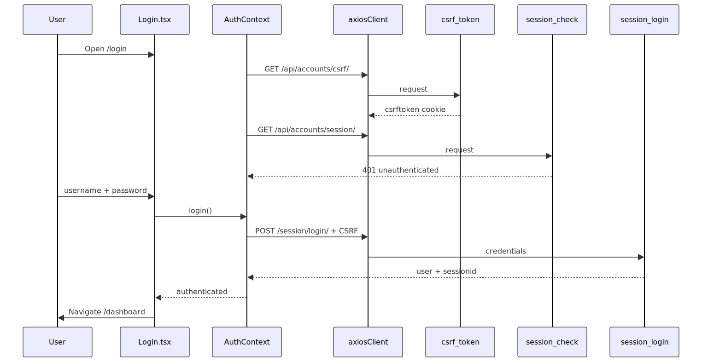
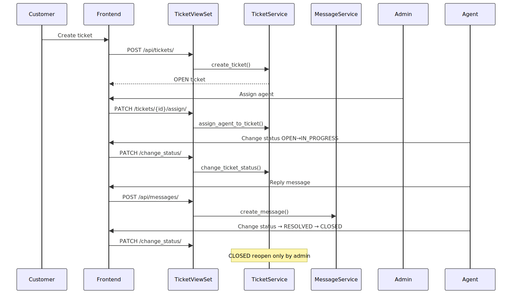
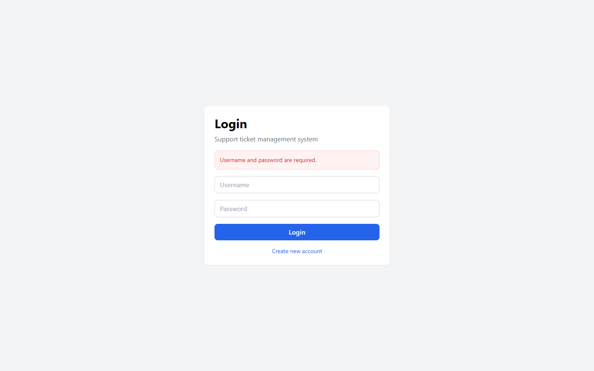

# گزارش فاز ۳ — سامانه مدیریت درخواست‌های پشتیبانی

**نسخه سند:** 1.0  
**تاریخ:** ۲۷ تیر ۱۴۰۵ / 2026-07-18  
**مبنای نیازمندی‌ها:** `docs/SRS.pdf`  
**مبنای پیاده‌سازی:** کد منبع Backend و Frontend پروژه محلی  

---

## ۱. مقدمه

این گزارش وضعیت پیاده‌سازی سامانه مدیریت تیکت را نسبت به سند مشخصه نیازمندی‌ها (SRS) مستند می‌کند. در تهیه این گزارش، **کد منبع** به‌عنوان حقیقت پیاده‌سازی و **SRS** به‌عنوان حقیقت نیازمندی در نظر گرفته شده است. هیچ قابلیتِ پیاده‌سازی‌نشده‌ای به‌عنوان «تکمیل‌شده» گزارش نشده و نتایج تست‌ها فقط بر اساس اجرای واقعی محلی ثبت شده‌اند.

خروجی‌های مکمل این گزارش در مسیر `docs/phase-3/` شامل ماتریس ردیابی نیازمندی‌ها، نتایج تست بک‌اند، نمودارهای C4، تصاویر رابط کاربری، گزارش CI و شواهد ترمینال است.

---

## ۲. نیازمندی‌های پیاده‌سازی‌شده

بر اساس تطبیق SRS (صفحات ۱۱–۱۲ و بخش‌های مرتبط) با کد:

| شناسه | عنوان | وضعیت |
|-------|--------|--------|
| FR-01 | ایجاد درخواست پشتیبانی | پیاده‌سازی شده |
| FR-03 | مدیریت وضعیت درخواست | پیاده‌سازی شده |
| FR-04 | تعامل کاربر با کارشناس (پیام‌ها) | پیاده‌سازی شده |
| FR-06 | پیگیری درخواست توسط کاربر | پیاده‌سازی شده |
| FR-10 | احراز هویت نام کاربری/رمز | پیاده‌سازی شده |
| FR-11 | کنترل دسترسی نقش‌ها (RBAC) | پیاده‌سازی شده |
| FR-12 | مدیریت کاربران و نقش‌ها | پیاده‌سازی شده |
| FR-13 | فیلتر و جستجوی تیکت | پیاده‌سازی شده |
| FR-14 | مستندات Swagger/OpenAPI | پیاده‌سازی شده |
| NFR-05 | دسترسی مبتنی بر مرورگر | پیاده‌سازی شده |

نمونه‌های شواهد کد:
- ایجاد تیکت: `backend/tickets/services/ticket_service.py` و `frontend/src/pages/CreateTicket.tsx`
- گردش وضعیت: `TicketService.change_ticket_status` با وضعیت‌های OPEN / IN_PROGRESS / RESOLVED / CLOSED
- داشبورد نقش‌محور: `backend/dashboard/services/dashboard_service.py` و `frontend/src/pages/Dashboard.tsx`
- نشست و CSRF: `backend/accounts/session_views.py` و `frontend/src/context/AuthContext.tsx`

جزئیات کامل در `requirements-traceability.md` آمده است.

---

## ۳. نیازمندی‌های ناقص یا پیاده‌سازی‌نشده

| شناسه | عنوان | وضعیت | توضیح کوتاه |
|-------|--------|--------|-------------|
| FR-02 | ارجاع خودکار تیکت | پیاده‌سازی نشده | فقط تخصیص دستی توسط Admin وجود دارد |
| FR-05 | داشبورد مدیریتی کامل SRS | جزئی | شمارش تیکت/کاربر/workload هست؛ زمان پاسخ و رضایت نیست |
| FR-07 | طبقه‌بندی هوشمند محتوا | جزئی | اولویت و دسته دستی؛ بدون دسته‌بندی خودکار محتوا |
| FR-08 | پاسخگویی خودکار FAQ | پیاده‌سازی نشده | مدل/API/UI وجود ندارد |
| FR-09 | امتیاز رضایت و زمان پاسخ | پیاده‌سازی نشده / جزئی | فقط آمار workload؛ بدون rating/SLA |
| NFR-01 | ۱۰۰ کاربر همزمان و ≤۳ثانیه | تأیید نشده | تست بار در شواهد موجود نیست |
| NFR-02..04 | امنیت HTTPS، بازیابی، یکپارچه‌سازی | جزئی | hashing/CSRF هست؛ HTTPS/backup/integration کامل نیست |

هم‌راستا با `docs/limits-and-roadmap.md`: نبود اعلان ایمیل، پیوست فایل، به‌روزرسانی بلادرنگ، و تست خودکار فرانت.

---

## ۴. نمودارهای C4 به‌روزشده

مدل C4 موجود در `docs/c4-model.md` با پیاده‌سازی فعلی هم‌خوانی دارد و برای فاز ۳ به‌صورت SVG در `docs/phase-3/c4/` صادر شده است:

| فایل | سطح |
|------|------|
| `c4/01-system-context.svg` | System Context |
| `c4/02-container.svg` | Container |
| `c4/03-backend-components.svg` | Backend Components |
| `c4/04-frontend-components.svg` | Frontend Components |
| `c4/05-login-flow.svg` | جریان ورود |
| `c4/06-ticket-lifecycle.svg` | چرخه عمر تیکت |

منبع Mermaid هر نمودار با پسوند `.mmd` کنار SVG ذخیره شده است. کانتینرها: React SPA، Django REST API، SQLite، Swagger. اجزای بک‌اند روی لایه View → Service → Model منطبق‌اند.









---

## ۵. نتایج تست بک‌اند

اجرای محلی مطابق دستور CI:

```text
python manage.py test accounts.tests tickets.tests dashboard.tests
Ran 77 tests in ~98.1s
OK
```

| شاخص | مقدار |
|------|------:|
| کل تست‌ها | ۷۷ |
| موفق | ۷۷ |
| ناموفق | ۰ |
| نرخ موفقیت | ۱۰۰٪ |

جزئیات تک‌تک تست‌ها: `backend-test-results.md`  
خروجی ترمینال: `evidence/backend-test-run.txt`

پوشش تست شامل سرویس و API حساب‌ها، تیکت‌ها، پیام‌ها، دسته‌ها و داشبورد است. تست خودکار Frontend در این فاز اجرا/موجود نیست.

---

## ۶. تصاویر اصلی رابط کاربری

| موضوع | فایل |
|--------|------|
| ورود | `screenshots/01-login.png` |
| داشبورد مشتری | `screenshots/02-customer-dashboard.png` |
| لیست تیکت | `screenshots/03-ticket-list.png` |
| جزئیات تیکت | `screenshots/04-ticket-details.png` |
| داشبورد ادمین | `screenshots/06-admin-dashboard.png` |
| داشبورد کارشناس | `screenshots/07-agent-dashboard.png` |
| تخصیص تیکت | `screenshots/08-ticket-assignment.png` |
| Swagger | `screenshots/09-swagger.png` |


---

## ۷. تصاویر تعامل Frontend

| تعامل | فایل |
|--------|------|
| اعتبارسنجی ورود خالی | `before-after-validation-empty-submit.png` |
| اعتبارسنجی ورود نامعتبر | `before-after-validation-invalid-login.png` |
| ایجاد تیکت — بعد از ثبت | `before-after-ticket-creation-after.png` |
| به‌روزرسانی وضعیت — قبل از تغییر | `before-after-status-update-before.png` |
| فیلتر لیست — بعد از اعمال فیلتر | `before-after-filtering-after.png` |




این تصاویر از اجرای واقعی UI روی `http://127.0.0.1:5173` با API محلی گرفته شده‌اند. اطلاعات ورود آزمایشی در این گزارش درج نشده است.

---

## ۸. CI

فایل `.github/workflows/ci.yml` دو Job دارد:

1. **Backend:** Python 3.12 → نصب وابستگی → بررسی migration → migrate → `manage.py check` → تست ماژول‌های accounts/tickets/dashboard  
2. **Frontend:** Node 20 → `npm ci` → `tsc --noEmit` → `npm run build`

**ادعای موفقیت اجرای GitHub Actions در این بسته وجود ندارد**؛ فقط پیکربندی workflow و اجرای محلی تست بک‌اند مستند شده است. جزئیات: `ci-report.md`.

---

## ۹. محدودیت‌ها

- پایگاه‌داده SQLite (مناسب توسعه، نه مقیاس بالا)
- نبود اعلان ایمیل، پیوست فایل، WebSocket
- نبود پاسخ خودکار FAQ و امتیاز رضایت کاربر
- تخصیص خودکار تیکت پیاده‌سازی نشده
- نبود تست خودکار Frontend / E2E
- احراز هویت مبتنی بر Session/Cookie (بدون JWT)
- سناریوی بار ۱۰۰ کاربر همزمان در شواهد موجود نیست

---

## ۱۰. نتیجه‌گیری

هسته عملیاتی سامانه تیکتینگ مطابق SRS اولیه برای ثبت، پیگیری، گفتگو، نقش‌ها و داشبوردهای پایه **پیاده‌سازی و با ۷۷ تست بک‌اند تأیید شده است**. فاصله اصلی با SRS/Vision در قابلیت‌های هوشمند/تحلیلی است: ارجاع خودکار، FAQ، رضایت‌سنجی و اندازه‌گیری زمان پاسخ. نمودارهای C4، ردیابی نیازمندی‌ها و شواهد UI/تست برای فاز ۳ آماده و در `docs/phase-3/` گردآوری شده‌اند.

---

## پیوست — فهرست فایل‌های تولیدشده

```
docs/phase-3/
├── phase-3-report.md
├── phase-3-report.pdf
├── requirements-traceability.md
├── backend-test-results.md
├── ci-report.md
├── screenshots/
├── c4/
└── evidence/
```
