# Requirements Traceability Matrix — Phase 3

**Sources of truth**
- Requirements: `docs/SRS.pdf` (plus supporting Vision scope in `docs/Vision.pdf`)
- Implementation: backend + `frontend/` source code
- Evidence date: 2026-07-18

SRS functional requirements on pages 11–12 do not use formal IDs. IDs below (`FR-*`, `NFR-*`) are assigned in document order for traceability. Vision-scope aspirational capabilities that appear in SRS prose are included where they affect coverage.

**Status legend:** Implemented | Partial | Not Implemented

---

## Functional Requirements

### FR-01 — ایجاد درخواست پشتیبانی (Create support ticket)
| Field | Value |
|-------|-------|
| **SRS page** | 11 |
| **Title** | ایجاد درخواست پشتیبانی |
| **Status** | **Implemented** |
| **Description (SRS)** | Users must register support requests as tickets with subject, description, and priority. |
| **Source code** | `backend/tickets/views.py` (`TicketViewSet.create`), `backend/tickets/services/ticket_service.py` (`create_ticket`), `backend/tickets/serializers.py` (`TicketCreateSerializer`), `frontend/src/pages/CreateTicket.tsx` |
| **Backend tests** | `tickets.tests.TicketServiceTestCase.test_create_ticket`, `tickets.tests.TicketAPITestCase.test_create_ticket_authenticated`, `test_create_ticket_unauthenticated`, `test_create_ticket_validation_short_title` |
| **Screenshots** | `screenshots/before-after-ticket-creation-after.png`, `screenshots/03-ticket-list.png` |

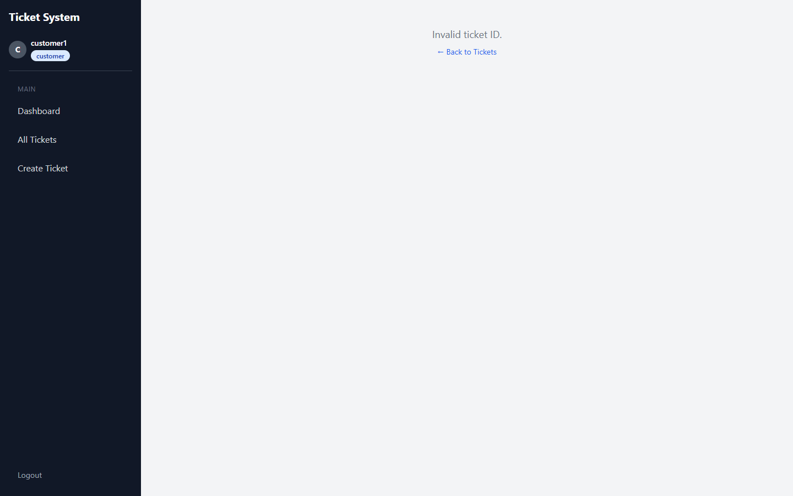 *پس از ایجاد*

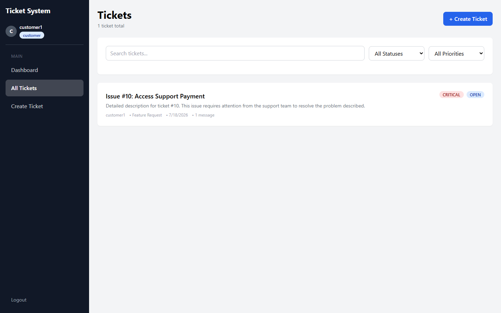 *لیست تیکت‌ها*

### FR-02 — پردازش خودکار درخواست و ارجاع (Automatic processing & assignment)
| Field | Value |
|-------|-------|
| **SRS page** | 11 |
| **Title** | پردازش خودکار درخواست و ارجاع آن |
| **Status** | **Not Implemented** (manual admin assignment exists instead) |
| **Description (SRS)** | After creation, system should assign the ticket to the related support agent by category/problem type. |
| **Source code** | No auto-routing service. Manual assign only: `backend/tickets/services/ticket_service.py` (`assign_agent_to_ticket` — admin only), `frontend/src/pages/TicketDetails.tsx` (Assign Agent UI) |
| **Backend tests** | Related (manual assign): `test_assign_agent_as_admin`, `test_assign_ticket_as_admin`, `test_assign_ticket_as_customer_forbidden` — these prove **manual** assign, not automatic |
| **Screenshots** | `screenshots/08-ticket-assignment.png` (manual assignment UI) |

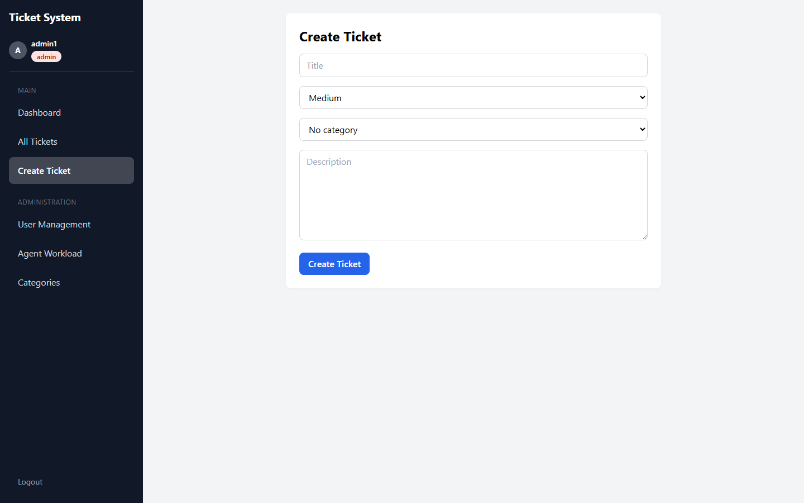 *تخصیص دستی کارشناس*

### FR-03 — مدیریت وضعیت درخواست (Ticket status management)
| Field | Value |
|-------|-------|
| **SRS page** | 11 |
| **Title** | مدیریت وضعیت درخواست |
| **Status** | **Implemented** |
| **Description (SRS)** | Tickets can be Open / In Progress / Resolved. Implementation also adds Closed with enforced transitions. |
| **Source code** | `backend/tickets/models.py` (`Ticket.Status`), `backend/tickets/services/ticket_service.py` (`change_ticket_status`, `VALID_TRANSITIONS`), `frontend/src/pages/TicketDetails.tsx` |
| **Backend tests** | `test_change_ticket_status_as_agent`, `test_change_ticket_status_as_customer_fails`, `test_valid_status_transition_*`, `test_invalid_status_transition_*`, `test_admin_can_reopen_closed_ticket`, `test_agent_cannot_reopen_closed_ticket`, `test_change_status_as_agent` |
| **Screenshots** | `screenshots/04-ticket-details.png`, `screenshots/before-after-status-update-before.png` |

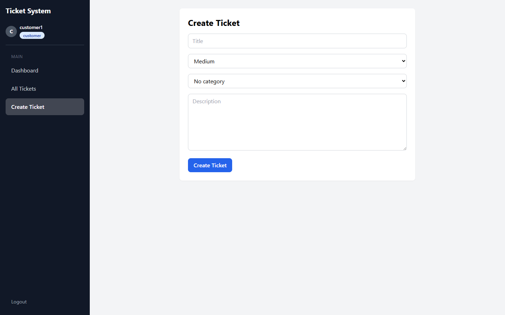 *جزئیات تیکت*

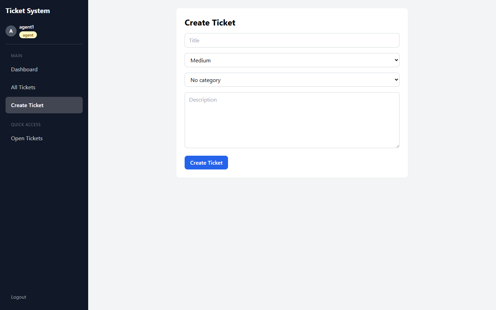 *به‌روزرسانی وضعیت*

### FR-04 — تعامل کاربر با کارشناس (User–agent conversation)
| Field | Value |
|-------|-------|
| **SRS page** | 12 |
| **Title** | تعامل کاربر با کارشناس |
| **Status** | **Implemented** |
| **Description (SRS)** | Users and agents can post messages inside a ticket. |
| **Source code** | `backend/tickets/views.py` (`TicketMessageViewSet`), `backend/tickets/services/message_service.py`, `frontend/src/pages/TicketDetails.tsx` (Messages section) |
| **Backend tests** | `MessageServiceTestCase.*`, `TicketMessageAPITestCase.*`, `test_cannot_message_on_closed_ticket` |
| **Screenshots** | `screenshots/04-ticket-details.png` |

### FR-05 — داشبورد مدیریتی (Admin management dashboard)
| Field | Value |
|-------|-------|
| **SRS page** | 12 |
| **Title** | دسترسی مدیر پشتیبانی به داشبورد مدیریتی |
| **Status** | **Partial** |
| **Description (SRS)** | Admin dashboard should show team performance, ticket counts, **response time**, and **user satisfaction**. |
| **Source code** | Implemented metrics: `backend/dashboard/services/dashboard_service.py`, `frontend/src/pages/Dashboard.tsx`, `frontend/src/pages/AdminAgentWorkload.tsx`. **Missing:** response-time fields, satisfaction/rating models/UI. |
| **Backend tests** | `DashboardServiceTestCase.*`, `DashboardAPITestCase.*` |
| **Screenshots** | `screenshots/06-admin-dashboard.png`, `screenshots/07-agent-dashboard.png`, `screenshots/02-customer-dashboard.png` |

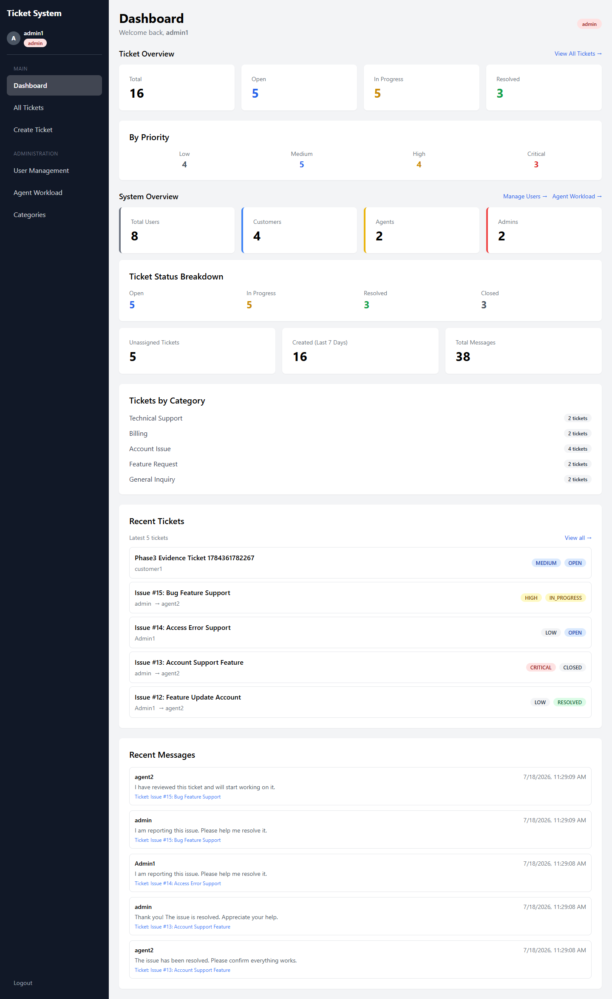 *داشبورد مدیر*

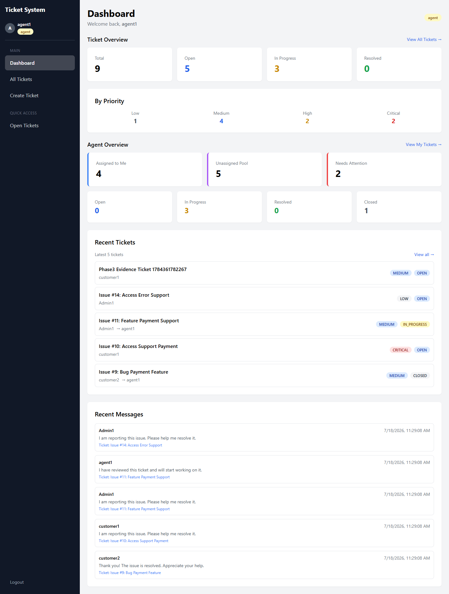 *داشبورد کارشناس*

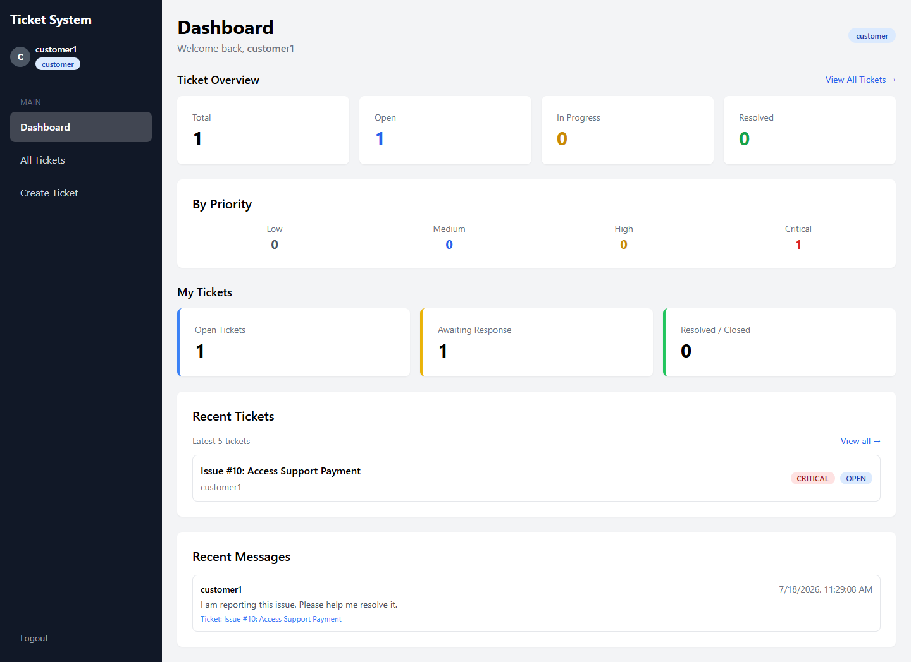 *داشبورد مشتری*

### FR-06 — پیگیری درخواست توسط کاربر (Customer ticket tracking)
| Field | Value |
|-------|-------|
| **SRS page** | 12 |
| **Title** | پیگیری درخواست توسط کاربر |
| **Status** | **Implemented** |
| **Description (SRS)** | Users can view status of their own tickets and follow progress. |
| **Source code** | `TicketService.get_tickets_for_user` (customer filter), `frontend/src/pages/Tickets.tsx`, `TicketDetails.tsx`, customer section of `Dashboard.tsx` |
| **Backend tests** | `test_get_tickets_for_customer`, `test_list_tickets_as_customer`, `test_retrieve_ticket_as_owner`, `test_customer_overview_includes_customer_metrics` |
| **Screenshots** | `screenshots/02-customer-dashboard.png`, `screenshots/03-ticket-list.png`, `screenshots/04-ticket-details.png` |

(تصاویر در FR-۰۱، FR-۰۵، FR-۰۶ همان‌ها هستند)

### FR-07 — طبقه‌بندی و اولویت‌بندی تیکت‌ها (Categorization & priority)
| Field | Value |
|-------|-------|
| **SRS page** | 6 (product function §2-1 item 2); also implied on p.11 create-ticket fields |
| **Title** | طبقهبندی و اولویتبندی تیکتها |
| **Status** | **Partial** |
| **Description** | SRS expects classification by subject/priority/content. Implementation supports manual priority + optional category; **no automatic content-based classification**. |
| **Source code** | `backend/tickets/models.py` (`priority`, `TicketCategory`), category APIs in `TicketCategoryViewSet`, `frontend/src/pages/CreateTicket.tsx`, `AdminCategories.tsx` |
| **Backend tests** | `TicketCategoryAPITestCase.*`, priority change tests |
| **Screenshots** | `screenshots/before-after-ticket-creation-after.png`, `screenshots/03-ticket-list.png` |

(تصاویر در FR-۰۱ و FR-۰۶ نمایش داده شده‌اند)

### FR-08 — پاسخگویی خودکار به سوالات پرتکرار (FAQ auto-reply)
| Field | Value |
|-------|-------|
| **SRS page** | 2–7 (product description); Vision p.3–4 |
| **Title** | پاسخگویی خودکار / بانک دانش سوالات پرتکرار |
| **Status** | **Not Implemented** |
| **Source code** | No FAQ/knowledge-base models, APIs, or pages found |
| **Backend tests** | None |
| **Screenshots** | None |

### FR-09 — ارزیابی عملکرد کارشناسان / رضایت / زمان پاسخ
| Field | Value |
|-------|-------|
| **SRS page** | 7 (§2-1 item 5), 12 (dashboard metrics) |
| **Title** | ارزیابی عملکرد کارشناسان (زمان پاسخ، امتیاز، نظرات) |
| **Status** | **Not Implemented** for ratings/response-time; **Partial** via agent workload counts |
| **Source code** | Workload counts: `DashboardService.get_agent_workload`, `AdminAgentWorkload.tsx`. No rating/SLA fields on models. |
| **Backend tests** | `test_get_agent_workload_counts`, `test_agents_workload_as_admin` |
| **Screenshots** | `screenshots/06-admin-dashboard.png` (counts only) |

(تصویر در FR-۰۵ نمایش داده شده است)

### FR-10 — احراز هویت مبتنی بر نام کاربری و رمز عبور
| Field | Value |
|-------|-------|
| **SRS page** | 12 (NFR امنیت) |
| **Title** | احراز هویت کاربران |
| **Status** | **Implemented** |
| **Source code** | `backend/accounts/session_views.py`, `frontend/src/pages/Login.tsx`, `frontend/src/context/AuthContext.tsx` |
| **Backend tests** | `test_login_success`, `test_login_invalid_credentials`, register/password tests |
| **Screenshots** | `screenshots/01-login.png`, `screenshots/before-after-validation-invalid-login.png` |

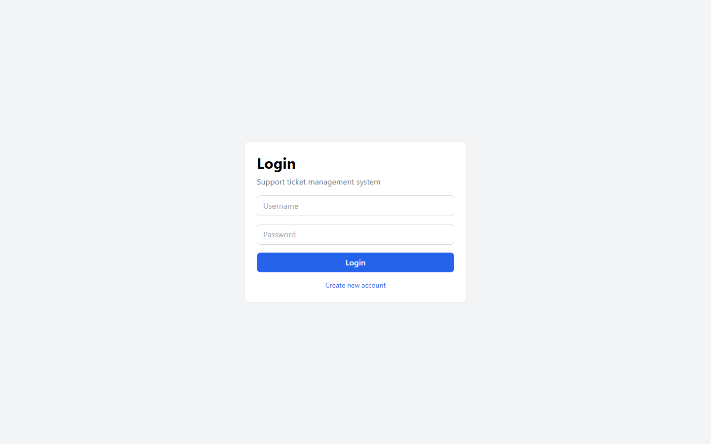 *صفحه ورود*

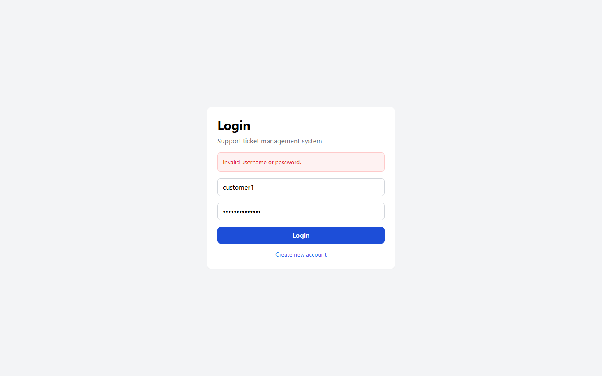 *اعتبارسنجی ورود نامعتبر*

### FR-11 — کنترل سطح دسترسی نقش‌ها (RBAC)
| Field | Value |
|-------|-------|
| **SRS page** | 12 (NFR امنیت) |
| **Title** | کنترل دسترسی مشتری / کارشناس / مدیر |
| **Status** | **Implemented** |
| **Source code** | `backend/accounts/models.py` (`role`), `backend/accounts/permissions.py`, `backend/tickets/permissions.py`, `frontend/src/App.tsx` (`Protected` / `AdminRoute`) |
| **Backend tests** | Multiple forbidden-path tests across accounts/tickets/dashboard |
| **Screenshots** | Role-specific dashboards: `02-`, `06-`, `07-` |

(داشبوردهای نقش‌محور در FR-۰۵ نمایش داده شده‌اند)

### FR-12 — مدیریت کاربران و نقش‌ها (Admin user management)
| Field | Value |
|-------|-------|
| **SRS page** | Implied by RBAC + admin actor (SRS/Vision); admin capabilities |
| **Title** | مدیریت کاربران و تغییر نقش |
| **Status** | **Implemented** |
| **Source code** | `backend/accounts/views.py` (`UserListView`, `UserRoleUpdateView`), `frontend/src/pages/AdminUsers.tsx` |
| **Backend tests** | `test_list_users_as_admin`, `test_update_user_role_as_admin`, `test_update_user_role_as_customer_forbidden` |
| **Screenshots** | Admin nav visible in `screenshots/06-admin-dashboard.png` |

(داشبورد مدیر در FR-۰۵ نمایش داده شده است)

### FR-13 — فیلتر / جستجوی تیکت‌ها
| Field | Value |
|-------|-------|
| **SRS page** | 12 (NFR کارایی — جستجو و نمایش لیست) |
| **Title** | جستجو و نمایش لیست تیکت‌ها |
| **Status** | **Implemented** (backend full; frontend status/priority/search) |
| **Source code** | `backend/tickets/views.py` (`filterset_fields`, `search_fields`), `frontend/src/pages/Tickets.tsx` |
| **Backend tests** | `test_filter_tickets_by_status` |
| **Screenshots** | `screenshots/before-after-filtering-after.png` |

 *فیلتر لیست*

### FR-14 — مستندات تعاملی API (Swagger)
| Field | Value |
|-------|-------|
| **SRS page** | Not a numbered FR; supports NFR maintainability / integration (SRS p.13) |
| **Title** | OpenAPI / Swagger documentation |
| **Status** | **Implemented** |
| **Source code** | `backend/ticketProject/urls.py` + `drf-spectacular` settings |
| **Backend tests** | N/A (docs endpoint) |
| **Screenshots** | `screenshots/09-swagger.png` |

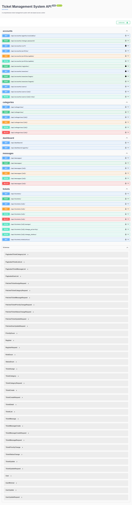 *مستندات Swagger*

---

## Non-Functional Requirements

### NFR-01 — کارایی (Performance)
| Field | Value |
|-------|-------|
| **SRS page** | 12 |
| **Title** | حداقل ۱۰۰ کاربر همزمان؛ پاسخ ≤ ۳ ثانیه |
| **Status** | **Not Implemented / Not Verified** |
| **Notes** | No load-test evidence in repo. SQLite + Django `runserver` used locally. |
| **Source code** | N/A |
| **Backend tests** | None for load |
| **Screenshots** | None |

### NFR-02 — امنیت ذخیره‌سازی و پروتکل‌ها
| Field | Value |
|-------|-------|
| **SRS page** | 12–13 |
| **Title** | ذخیره امن داده + پروتکل‌های امنیتی |
| **Status** | **Partial** |
| **Notes** | Django password hashing + session/CSRF implemented. Local demo uses HTTP (not HTTPS). SQLite file DB. |
| **Source code** | `backend/ticketProject/settings.py` (auth, CSRF, CORS, sessions) |
| **Backend tests** | Auth/permission tests |
| **Screenshots** | `screenshots/01-login.png` |

 *صفحه ورود*

### NFR-03 — اطمینان‌پذیری و پیام خطا
| Field | Value |
|-------|-------|
| **SRS page** | 13 |
| **Title** | پایداری، بازیابی، پیام خطای مناسب |
| **Status** | **Partial** |
| **Notes** | API returns structured errors; custom exception handler exists. No backup/recovery automation evidenced. |
| **Source code** | `backend/ticketProject/exceptions.py`, frontend error banners |
| **Backend tests** | Validation/auth failure tests |
| **Screenshots** | `screenshots/before-after-validation-invalid-login.png` |

### NFR-04 — قابلیت نگهداری و یکپارچه‌سازی
| Field | Value |
|-------|-------|
| **SRS page** | 13 |
| **Title** | ساختار کد/مستندات قابل توسعه؛ امکان یکپارچه‌سازی |
| **Status** | **Partial** |
| **Notes** | Layered View→Service→Model + docs + OpenAPI help maintainability. No external system integrations implemented. |
| **Source code** | `docs/`, `backend/*/services/`, Swagger |
| **Screenshots** | `screenshots/09-swagger.png` |

### NFR-05 — سازگاری مرورگر / چندسکویی
| Field | Value |
|-------|-------|
| **SRS page** | 13 |
| **Title** | دسترسی از طریق مرورگر روی OSهای مختلف |
| **Status** | **Implemented** (web SPA architecture) |
| **Notes** | React SPA accessed via browser; no native mobile app. Cross-browser suite not automated. |
| **Source code** | `frontend/` Vite React app |
| **Screenshots** | All UI screenshots |

---

## Coverage Summary

| Status | Count | IDs |
|--------|------:|-----|
| Implemented | 9 | FR-01, FR-03, FR-04, FR-06, FR-10, FR-11, FR-12, FR-13, FR-14, NFR-05* |
| Partial | 6 | FR-05, FR-07, FR-09, NFR-02, NFR-03, NFR-04 |
| Not Implemented | 4 | FR-02, FR-08, FR-09 ratings/SLA (counted under Partial/Not), NFR-01, FR-08 |

\*NFR-05 counted Implemented for browser-based delivery.

**Core SRS FR block (FR-01..FR-06):** 4 Implemented, 1 Partial (FR-05), 1 Not Implemented (FR-02).
