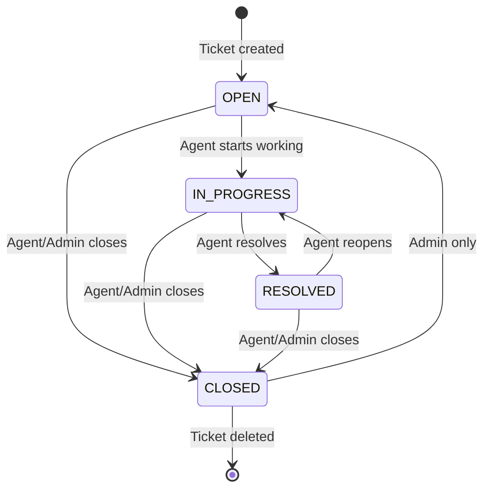
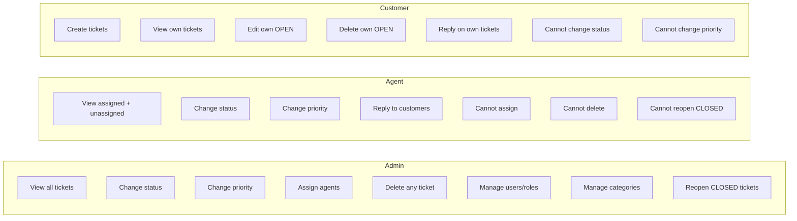

# Ticket Workflow

## Ticket Lifecycle

Tickets progress through four statuses: **OPEN → IN_PROGRESS → RESOLVED → CLOSED**. Each transition is validated by `TicketService.change_ticket_status` in `backend/tickets/services/ticket_service.py`.

### Status Definitions

| Status | Meaning |
|--------|---------|
| **OPEN** | Ticket created, not yet assigned or being worked on |
| **IN_PROGRESS** | Agent is actively working on the ticket |
| **RESOLVED** | Agent has resolved the issue (may be reopened if needed) |
| **CLOSED** | Ticket closed. Only admins can reopen a closed ticket |

---

## Status Transition Diagram



### Valid Transitions (from `TicketService.change_ticket_status`)

```python
VALID_TRANSITIONS = {
    'OPEN': ['IN_PROGRESS', 'CLOSED'],
    'IN_PROGRESS': ['RESOLVED', 'CLOSED'],
    'RESOLVED': ['IN_PROGRESS', 'CLOSED'],
    'CLOSED': ['OPEN'] if user.role == 'admin' else [],
}
```

| From → To | Who Can Perform |
|-----------|----------------|
| OPEN → IN_PROGRESS | Agent, Admin |
| OPEN → CLOSED | Agent, Admin |
| IN_PROGRESS → RESOLVED | Agent, Admin |
| IN_PROGRESS → CLOSED | Agent, Admin |
| RESOLVED → IN_PROGRESS | Agent, Admin |
| RESOLVED → CLOSED | Agent, Admin |
| CLOSED → OPEN | **Admin only** |

### Invalid Transitions (raise `ValueError`)

| From → To | Why Invalid |
|-----------|-------------|
| OPEN → RESOLVED | Must go through IN_PROGRESS first |
| RESOLVED → OPEN | Must go through IN_PROGRESS |
| CLOSED → OPEN (by agent) | Agent cannot reopen closed tickets |
| Any → Any (by customer) | Customers cannot change status at all |

### Closed Ticket Restrictions

- **No new messages** can be added to a `CLOSED` ticket (any role, including admin). The check is in `MessageService.create_message`:
  ```python
  if ticket.status == 'CLOSED':
      raise PermissionError("Cannot add messages to a closed ticket.")
  ```
- Only admins can reopen a `CLOSED` ticket (CLOSED → OPEN).

---

## Role-Based Access Rules

### Who Can Create Tickets

Any authenticated user can create a ticket via `POST /api/tickets/`. The ticket is automatically owned by the creating user. Customers register via the public registration endpoint; agents and admins are created by existing admins.

### Who Can View Tickets

| Role | Visible Tickets | Implementation |
|------|----------------|----------------|
| **Customer** | Own tickets only (`ticket.user == user`) | `TicketService.get_tickets_for_user` filters by `user=user` |
| **Agent** | Assigned tickets + unassigned pool | Filters by `Q(assigned_agent=user) \| Q(assigned_agent__isnull=True)` |
| **Admin** | All tickets | No filter |

### Ticket Assignment Rules

| Action | Rule |
|--------|------|
| Assign agent | Admin only (`PATCH /api/tickets/{id}/assign/`) |
| Target agent | Must exist and have `role == 'agent'` |
| Agent can work on | Assigned tickets + unassigned pool tickets |
| View assignment | Agents see assigned_agent field; customers see it |

### Priority Modification Rules

| Action | Rule |
|--------|------|
| Change priority | Agent or Admin only (`PATCH /api/tickets/{id}/change_priority/`) |
| Allowed values | `LOW`, `MEDIUM`, `HIGH`, `CRITICAL` |
| Customer | Cannot change priority |

### Message Creation Rules

| Rule | Check Location |
|------|----------------|
| Any role can message | `TicketMessageViewSet.create()` → `IsAuthenticated` |
| Customer: own tickets only | `MessageService.create_message()` |
| Agent: assigned or unassigned only | `MessageService.create_message()` |
| Closed tickets: no messages | `MessageService.create_message()` — blanket block |
| Message content: non-empty | `TicketMessageCreateSerializer.validate_message()` |

---

## Workflow Examples

### Example 1: Customer Creates and Agent Resolves

1. Customer creates a ticket → status `OPEN`
2. Admin assigns the ticket to an agent → `assigned_agent` set
3. Agent changes status to `IN_PROGRESS` → starts working
4. Agent replies with a message
5. Agent resolves the ticket → status `RESOLVED`
6. Customer views the resolution
7. Admin closes the ticket → status `CLOSED`

**Invalid attempt**: Customer tries to change status to `RESOLVED` → `PermissionError` (customers cannot change status).

### Example 2: Agent Reopens a Resolved Ticket

1. Agent changes status from `RESOLVED` to `IN_PROGRESS` → valid
2. This allows the agent to continue working if the issue was not fully resolved

### Example 3: Admin Reopens a Closed Ticket

1. Admin changes ticket from `CLOSED` to `OPEN` → valid (admin only)
2. The ticket re-enters the workflow

**Invalid attempt**: Agent tries to change from `CLOSED` to `OPEN` → `ValueError` (agent not in allowed transitions).

### Example 4: Customer Edits Their Ticket

1. Customer creates a ticket → status `OPEN`
2. Customer updates the title/description → valid (own OPEN ticket)
3. Agent changes status to `IN_PROGRESS`
4. Customer tries to update the ticket → `CanModifyTicket` denies (status is not OPEN)

### Example 5: Deleting Tickets

1. Customer deletes their own OPEN ticket → valid
2. Customer tries to delete a CLOSED ticket → `CanDeleteTicket` denies (not OPEN)
3. Agent tries to delete any ticket → `CanDeleteTicket` denies (agent cannot delete)
4. Admin deletes any ticket → valid

---

## Role Summary



---

## Related Documents

- [Authentication & RBAC](authentication-and-rbac.md) — full permission matrix
- [API Reference](api-reference.md) — ticket endpoint details
- [Backend](backend.md) — service layer implementation
