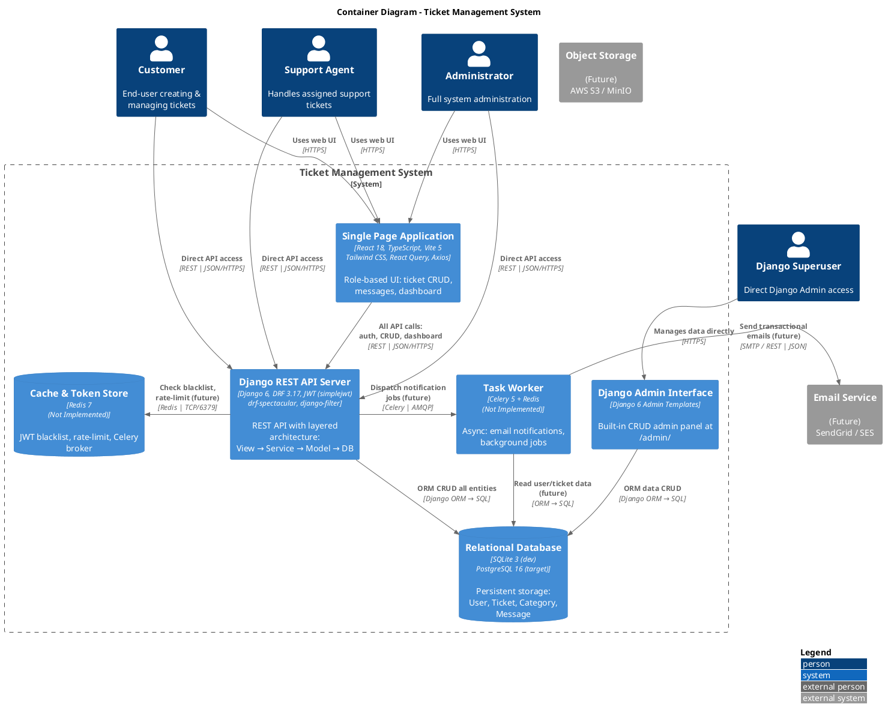

# 🏗️ Ticket Management System — Architecture Documentation

> **C4 Model** — System Context & Container Diagrams
>
> Generated: 2026-06-09
>
> **⚠️ This document reflects the ACTUAL project state.**  
> Recommended additions are clearly marked with **(Recommended)** — they do not exist yet.

---

## Table of Contents

1. [System Context Diagram](#-document-1--system-context-diagram)
2. [Container Diagram](#-document-2--container-diagram)
3. [Architecture Analysis](#-final-architecture-analysis)

---

# 📐 Document 1 — System Context Diagram

## 1. Users

| # | Name | Role | Description |
|---|------|------|-------------|
| U1 | **Customer** | End-User | Signs up, logs in, creates support tickets, tracks ticket status (OPEN / IN_PROGRESS / RESOLVED / CLOSED), sends and reads messages on own tickets, views personal dashboard with ticket statistics. Interacts only with own data. |
| U2 | **Support Agent** | Staff | Views assigned tickets and unassigned pool, updates ticket status and priority, participates in ticket conversations, views role-specific dashboard showing workload and needs-attention tickets. |
| U3 | **Administrator** | System Manager | Full CRUD on all users and tickets, assigns agents to tickets, creates and manages ticket categories, updates user roles (customer → agent → admin), views global dashboard with system-wide metrics, agent workload breakdown, and per-category ticket distribution. |
| U4 | **Django Superuser** | DevOps / Developer | Manages the system directly via Django Admin panel (`/admin/`) for database inspection, manual overrides, and seed data seeding. |

## 2. External Systems

> **Current state:** The project does NOT integrate with any external service yet.  
> The external systems listed below are **future requirements** identified during architecture review.

| # | Name | Status | Description | Role in Interaction |
|---|------|--------|-------------|---------------------|
| E1 | **Email Notification Service** (SendGrid / Amazon SES) | **🔴 Not Implemented** | Transactional email delivery — password resets, ticket assignment alerts, status change notifications. | Would receive dispatch requests from the backend. |
| E2 | **Production PostgreSQL Database** | **🟡 Planned** | Relational database for persistent production storage, replacing SQLite. | Would store all application data — users, tickets, messages, categories. |
| E3 | **Object Storage** (AWS S3 / MinIO) | **🔴 Not Implemented** | Scalable storage for user-uploaded files (ticket attachments, profile images). | Would serve and store static/media assets. |

## 3. Main System

| Name | Description |
|------|-------------|
| **Ticket Management System** | A role-based (Customer / Agent / Admin) ticket management platform. Backend is a Django 6 monolithic REST API with layered service architecture, JWT authentication, and OpenAPI docs. Frontend is a decoupled React 18 SPA served separately. The system handles ticket CRUD, assignment workflows, threaded messaging, and role-specific dashboards. |

## 4. Relationships

### 4.1 — User → Main System

| # | Source | Destination | Label | Initiator | Protocol / Format |
|---|--------|-------------|-------|-----------|-------------------|
| R1 | Customer | Ticket Management System | Registers account | Customer | [REST | JSON/HTTPS] |
| R2 | Customer | Ticket Management System | Logs in via JWT (receives access + refresh tokens) | Customer | [REST | JSON/HTTPS] |
| R3 | Customer | Ticket Management System | Creates new tickets (title, description, priority, category) | Customer | [REST | JSON/HTTPS] |
| R4 | Customer | Ticket Management System | Views own tickets (list with filtering/search/pagination) | Customer | [REST | JSON/HTTPS] |
| R5 | Customer | Ticket Management System | Reads and sends messages on own tickets | Customer | [REST | JSON/HTTPS] |
| R6 | Customer | Ticket Management System | Updates own OPEN tickets (title, description, priority) | Customer | [REST | JSON/HTTPS] |
| R7 | Customer | Ticket Management System | Deletes own OPEN tickets | Customer | [REST | JSON/HTTPS] |
| R8 | Customer | Ticket Management System | Views personal dashboard (open/closed ticket counts) | Customer | [REST | JSON/HTTPS] |
| R9 | Customer | Ticket Management System | Changes password, updates profile | Customer | [REST | JSON/HTTPS] |
| R10 | Support Agent | Ticket Management System | Logs in and views assigned/unassigned tickets | Agent | [REST | JSON/HTTPS] |
| R11 | Support Agent | Ticket Management System | Changes ticket status (OPEN → IN_PROGRESS → RESOLVED → CLOSED) | Agent | [REST | JSON/HTTPS] |
| R12 | Support Agent | Ticket Management System | Changes ticket priority (LOW / MEDIUM / HIGH / CRITICAL) | Agent | [REST | JSON/HTTPS] |
| R13 | Support Agent | Ticket Management System | Sends and reads messages on assigned/unassigned tickets | Agent | [REST | JSON/HTTPS] |
| R14 | Support Agent | Ticket Management System | Views agent dashboard (workload, needs-attention count) | Agent | [REST | JSON/HTTPS] |
| R15 | Administrator | Ticket Management System | Lists all users, views user details | Admin | [REST | JSON/HTTPS] |
| R16 | Administrator | Ticket Management System | Updates user roles (promote to agent/admin) | Admin | [REST | JSON/HTTPS] |
| R17 | Administrator | Ticket Management System | Assigns agents to tickets | Admin | [REST | JSON/HTTPS] |
| R18 | Administrator | Ticket Management System | Manages ticket categories (CRUD) | Admin | [REST | JSON/HTTPS] |
| R19 | Administrator | Ticket Management System | Views global dashboard (total users by role, tickets by status/priority/category, agent workload) | Admin | [REST | JSON/HTTPS] |
| R20 | Administrator | Ticket Management System | Views available agents sorted by workload | Admin | [REST | JSON/HTTPS] |
| R21 | Django Superuser | Ticket Management System | Accesses Django Admin panel for direct data CRUD | Superuser | [HTTPS | Django Templates] |

### 4.2 — Main System → External Systems

| # | Source | Destination | Label | Status | Protocol / Format |
|---|--------|-------------|-------|--------|-------------------|
| R22 | Ticket Management System | Email Notification Service (E1) | Sends transactional notifications | **🔴 Not Implemented** | [SMTP / REST | JSON/HTTPS] |
| R23 | Ticket Management System | PostgreSQL Database (E2) | Read/Write all persistent data | **🟡 Planned** | [SQL | TCP/5432] |
| R24 | Ticket Management System | Object Storage (E3) | Store/retrieve file attachments | **🔴 Not Implemented** | [S3 API | HTTPS] |

---

## 5. Current Database

In development, the system uses **SQLite 3** at `ticketProject/db.sqlite3` with the Django ORM abstracting all database access.

For production, the architecture supports swapping SQLite for **PostgreSQL** via a single settings change — the ORM layer hides the database engine.

## 6. PlantUML — System Context Diagram

```plantuml
@startuml SystemContext
!include <C4/C4_Context>
!include <C4/C4_Container>

LAYOUT_WITH_LEGEND()

title System Context Diagram - Ticket Management System

Person(customer, "Customer", "Creates & manages own support tickets")
Person(agent, "Support Agent", "Handles assigned & unassigned tickets")
Person(admin, "Administrator", "Full system & user management")
Person(superuser, "Django Superuser", "Direct Django Admin access")

System_Boundary(tms, "Ticket Management System") {
    System(tms_system, "Ticket Management System", "Django 6 monolithic REST API +\nReact 18 SPA frontend")
}

System_Ext_Ext(email, "Email Notification Service", "(Not Implemented)\nSendGrid / Amazon SES")
System_Ext_Ext(pg, "PostgreSQL Database", "(Planned)\nProduction persistent storage")
System_Ext_Ext(s3, "Object Storage", "(Not Implemented)\nAWS S3 / MinIO")

Rel(customer, tms_system, "Registers, creates tickets, messages, views dashboard", "REST | JSON/HTTPS")
Rel(agent, tms_system, "Manages tickets, changes status/priority, converses", "REST | JSON/HTTPS")
Rel(admin, tms_system, "Manages users/roles/categories, assigns agents", "REST | JSON/HTTPS")
Rel(superuser, tms_system, "Manages system via Django Admin", "HTTPS | HTML")

Rel(tms_system, email, "Sends notifications on ticket events (future)", "")
Rel(tms_system, pg, "Planned database migration target", "SQL | TCP/5432")
Rel(tms_system, s3, "Future file attachment storage", "S3 API | HTTPS")

@enduml
```

---

# 📐 Document 2 — Container Diagram

## 1. Containers

| # | Name | Status | Responsibility | Technology Stack |
|---|------|--------|---------------|-----------------|
| C1 | **Single Page Application** | ✅ **Existing** | React-based frontend providing the complete UI for all three roles. Handles client-side routing (React Router), server state management (TanStack React Query), JWT token lifecycle with automatic 401 → refresh flow (Axios interceptor), role-aware navigation (sidebar changes per role), and API communication with the backend. | React 18, TypeScript, Vite 5, Tailwind CSS 3, React Router 6, TanStack React Query 5, Axios |
| C2 | **Django REST API Server** | ✅ **Existing** | Core backend serving all RESTful endpoints. Enforces JWT authentication (simplejwt), implements two-tier permissions (view-level role checks + object-level ownership checks), delegates business logic to dedicated service classes (`TicketService`, `MessageService`, `UserService`, `DashboardService`), validates requests via serializers, provides rich query capabilities (filtering, search, ordering, pagination), and auto-generates OpenAPI 3.0 schema via drf-spectacular. Runs under Gunicorn WSGI in production. | Django 6, Django REST Framework 3.17, django-filter, djangorestframework-simplejwt 5.5, drf-spectacular 0.29, django-cors-headers 4.7, Gunicorn |
| C3 | **Django Admin Interface** | ✅ **Existing** | Built-in Django admin panel served by the same Django process at `/admin/`. Provides superuser-level CRUD on all models for operational support. | Django 6 Admin Templates |
| C4 | **Relational Database** | ✅ **Existing** (SQLite) / 🟡 **Planned** (PostgreSQL) | Primary data store for all persistent entities: accounts.User (custom model with role field), tickets.Ticket (with status/priority lifecycle), tickets.TicketCategory, tickets.TicketMessage. Currently SQLite in development; PostgreSQL planned for production via same ORM abstraction. | SQLite 3 (dev) / PostgreSQL 16 (target) |
| C5 | **Cache & Token Store** | **🔴 Not Implemented** | In-memory cache for JWT token blacklisting and rate-limiting counters. Would also serve as Celery broker for async task processing. | Redis 7 |
| C6 | **Task Worker** | **🔴 Not Implemented** | Async background worker for sending transactional emails, decoupling notification delivery from the API request lifecycle. | Celery 5 + Redis Broker |

---

## 2. Internal Relationships (Container → Container)

| # | Source | Destination | Label | Initiator | Protocol / Method |
|---|--------|-------------|-------|-----------|-------------------|
| CR1 | SPA (C1) | Django REST API Server (C2) | All authenticated API requests: auth, ticket CRUD, messages, dashboard, user management | SPA | [REST | JSON/HTTPS] |
| CR2 | Django REST API Server (C2) | Database (C4) | ORM-based CRUD on all entities: users, tickets, messages, categories | API Server | [Django ORM → SQL | SQLite file / TCP] |
| CR3 | Django Admin Interface (C3) | Database (C4) | Direct ORM-based data CRUD via Django Admin | Admin Interface | [Django ORM → SQL | SQLite file / TCP] |

### Future Internal Relationships (Not Yet Implemented)

| # | Source | Destination | Label | Initiator | Protocol / Method |
|---|--------|-------------|-------|-----------|-------------------|
| CR4 ⏳ | Django REST API Server (C2) | Cache & Token Store (C5) | JWT blacklist check, rate-limit counters | API Server | [Redis Protocol | TCP/6379] |
| CR5 ⏳ | Django REST API Server (C2) | Task Worker (C6) | Enqueues email notification jobs | API Server | [Celery Message | AMQP] |
| CR6 ⏳ | Task Worker (C6) | Cache & Token Store (C5) | Consumes task queue via Redis broker | Task Worker | [Celery → Redis | TCP/6379] |
| CR7 ⏳ | Task Worker (C6) | Database (C4) | Reads notification data (user emails, ticket info) | Task Worker | [Django ORM → SQL | SQL/TCP] |

---

## 3. External Relationships (User / External System → Container)

| # | Source | Destination | Label | Initiator | Protocol / Method |
|---|--------|-------------|-------|-----------|-------------------|
| ER1 | Customer (U1) | SPA (C1) | Accesses UI: login, register, ticket CRUD, messages, dashboard | Customer | [HTTPS | HTML + JS + JSON] |
| ER2 | Support Agent (U2) | SPA (C1) | Accesses UI: ticket list, status/priority changes, conversations, dashboard | Agent | [HTTPS | HTML + JS + JSON] |
| ER3 | Administrator (U3) | SPA (C1) | Accesses UI: user management, global dashboard, categories, agent assignment | Admin | [HTTPS | HTML + JS + JSON] |
| ER4 | Django Superuser (U4) | Django Admin Interface (C3) | Direct data management via `/admin/` | Superuser | [HTTPS | HTML + Django Templates] |
| ER5 | Customer (U1) | Django REST API Server (C2) | Direct API calls via `curl`, Postman, or mobile app (no SPA) | Customer | [REST | JSON/HTTPS] |
| ER6 | Support Agent (U2) | Django REST API Server (C2) | Direct API calls (no SPA) | Agent | [REST | JSON/HTTPS] |
| ER7 | Administrator (U3) | Django REST API Server (C2) | Direct API calls (no SPA) | Admin | [REST | JSON/HTTPS] |
| ER8 ⏳ | Task Worker (C6) | Email Notification Service (E1) | Sends transactional emails (future) | Task Worker | [SMTP / REST | JSON/HTTPS] |
| ER9 ⏳ | SPA (C1) | Object Storage (E3) | Uploads/downloads ticket attachments (future) | SPA | [S3 API | HTTPS] |

> **Note:** ER5–ER7 exist because the API is fully accessible via REST — any HTTP client can interact with it independently of the SPA.

---

## 4. Current Deployment Architecture

> This diagram shows what actually runs in development today.

```
┌──────────────────────────────────────────────────────────┐
│                   DEVELOPMENT SETUP                        │
│                                                           │
│  ┌─────────────────────┐     ┌────────────────────────┐   │
│  │  Vite Dev Server     │     │  Django Dev Server     │   │
│  │  Port 5173           │────>│  Port 8000             │   │
│  │  React SPA           │     │  REST API + Admin      │   │
│  │  (Hot Reload)        │     │  (Auto-reload)         │   │
│  └─────────────────────┘     └───────────┬────────────┘   │
│                                          │                 │
│                                          ▼                 │
│                              ┌──────────────────────┐      │
│                              │  SQLite Database      │      │
│                              │  db.sqlite3 (file)    │      │
│                              └──────────────────────┘      │
└──────────────────────────────────────────────────────────┘
```

### Recommended Production Deployment

```
┌────────────────────────────────────────────────────────────┐
│                  PRODUCTION RECOMMENDATION                    │
│                                                              │
│  ┌──────────────────────┐    ┌────────────────────────────┐  │
│  │  CDN / Nginx (Static) │───>│  React SPA (Built)         │  │
│  │                       │    │  ticket-frontend/dist/      │  │
│  └──────────────────────┘    └────────────────────────────┘  │
│                                │ HTTPS                        │
│                                ▼                              │
│  ┌──────────────────────────────────────────────────────┐    │
│  │  Reverse Proxy (Nginx)                                │    │
│  │  /api/* → Gunicorn  |  /admin/* → Gunicorn            │    │
│  └──────────────────────┬────────────────────────┬───────┘    │
│                         │                        │            │
│                         ▼                        ▼            │
│  ┌──────────────────────────┐  ┌─────────────────────────┐   │
│  │  Gunicorn + Django       │  │  Django Admin            │   │
│  │  (multi-worker)          │  │  (same Django process)    │   │
│  └──────┬───────────────────┘  └─────────────────────────┘   │
│         │                                                     │
│         ▼                                                     │
│  ┌──────────────────────┐                                     │
│  │  PostgreSQL Database  │                                     │
│  └──────────────────────┘                                     │
└────────────────────────────────────────────────────────────┘
```

---

## 5. PlantUML — Container Diagram



---

# 🏛️ Final Architecture Analysis

## Architecture Style

| Aspect | Classification |
|--------|---------------|
| **Pattern** | **Monolithic Backend + Decoupled SPA Frontend** with a **Layered Service Architecture** inside the backend |
| **API Style** | RESTful JSON API with JWT Bearer token authentication (access + refresh tokens) |
| **Deployment Model** | Two-tier: frontend (static SPA built by Vite, served via Nginx/CDN) and backend (Django WSGI application via Gunicorn) |
| **Current Infra** | Vite dev server + Django dev server + SQLite single file |

### Backend Internal Layering

```
HTTP Request
    │
    ▼
┌────────────────────┐
│   View Layer        │  ← Permission checks, serializer dispatch, response formatting
│   (*/views.py)      │
└────────┬───────────┘
         │ delegates to
         ▼
┌────────────────────┐
│   Service Layer     │  ← Business logic, validation rules, data aggregation
│   (*/services/*.py) │
└────────┬───────────┘
         │ uses
         ▼
┌────────────────────┐
│   Model Layer       │  ← ORM schema, relationships, indexes, constraints
│   (*/models.py)     │
└────────┬───────────┘
         │ persists to
         ▼
┌────────────────────┐
│   Database          │  ← SQLite (dev) / PostgreSQL (target)
│   (SQL)             │
└────────────────────┘

Serializer Layer (cross-cutting):
  Validates input at the boundary (views)
  Transforms output (nesting, field selection)
  Defined in */serializers.py
```

### Django App Breakdown

| App | Responsibility | Key Models | Service Classes |
|-----|---------------|------------|-----------------|
| `accounts` | User management, authentication, profile, role management | `User` (extends `AbstractUser` with `role` field) | `UserService` |
| `tickets` | Ticket CRUD, status/priority workflow, messaging, categories | `Ticket`, `TicketMessage`, `TicketCategory` | `TicketService`, `MessageService` |
| `dashboard` | Role-aware metrics aggregation, dashboard overview, workload reports | — (uses other apps' models) | `DashboardService` |
| `ticketProject` | Project config, root URL routing, exception handling, logging | — | — |

---

## Key Strengths (What Exists Today)

| # | Strength | Technical Detail |
|---|----------|------------------|
| S1 | **Layered Service Architecture** | Business logic is cleanly separated from HTTP handling. `TicketService`, `MessageService`, `UserService`, `DashboardService` are independently testable without HTTP context — 69 tests across all services. |
| S2 | **Two-Level Permission System** | (1) **View-level**: `IsAdmin`, `IsAgentOrAdmin`, `IsCustomer` roles guard entire endpoints. (2) **Object-level**: `CanModifyTicket`, `CanDeleteTicket`, `IsTicketOwnerOrAgentOrAdmin` check ownership and role per-request. (3) **Service-layer**: additional business-rule enforcement (e.g., only admins can assign agents) — defense in depth. |
| S3 | **Seamless JWT Auto-Refresh** | Frontend Axios interceptor catches 401 responses, automatically calls `/api/accounts/refresh/`, stores the new access token, and retries the original request — users stay authenticated without page reload. |
| S4 | **Role-Aware Dashboard** | Single `/api/dashboard/` endpoint returns different payload shape per role: **Customer** sees open/resolved counts; **Agent** sees assigned workload + unassigned pool + needs-attention count; **Admin** sees global stats (users by role, tickets by status/priority/category, agent workload). Implemented purely in `DashboardService` — no client-side role-sniffing needed. |
| S5 | **Rich Query Capabilities** | Built-in filtering (status, priority, category, assigned_agent), search (title, description), ordering (created_at, updated_at, priority), and pagination (page size 10) — all via DRF backends + django-filter, zero custom query code. |
| S6 | **OpenAPI Documentation Auto-Generated** | drf-spectacular introspects all viewsets and serializers to produce Swagger UI (`/api/docs/`), ReDoc (`/api/redoc/`), and raw OpenAPI schema (`/api/schema/`). Docs stay in sync with code. |
| S7 | **Custom User Model from Day One** | `AUTH_USER_MODEL = 'accounts.User'` with a `role` field (`customer` / `agent` / `admin`). Adding this to an existing Django project with migrations is painful — having it from the start is correct architectural foresight. |
| S8 | **Semantic URL Structure** | URLs follow a logical pattern: `/api/accounts/*` (auth + users), `/api/tickets/*` (tickets + custom actions), `/api/messages/*` (messages), `/api/categories/*` (categories), `/api/dashboard/*` (metrics). Clean, predictable, version-ready. |
| S9 | **Comprehensive Test Suite** | 69 tests across all three apps covering service logic, API endpoints, permissions, edge cases, and error handling. Tests exercise the full permission matrix. |
| S10 | **Production-Ready Logging** | Dual-output logging (file + console) at INFO level with verbose format (`{levelname} {asctime} {module} {message}`), separate Django logger, and production security settings (HSTS, SSL redirect, secure cookies) when `DEBUG=False`. |

---

## Possible Bottlenecks

| # | Bottleneck | Why It Matters | Severity |
|---|-----------|----------------|----------|
| B1 | **SQLite in Development** | SQLite has **no concurrent write support** — parallel API requests or simultaneous test runs cause `database is locked` errors. Not suitable for team development. | **Medium** |
| B2 | **No Production Database Yet** | The entire system runs on SQLite. No PostgreSQL configuration exists — the migration to a production-grade database will require effort and testing. | **Medium** |
| B3 | **No Async Task Queue** | Any future feature that needs background processing (email, notifications, file processing) would block the request thread. No Celery/Redis infrastructure exists yet. | **Low** (no async feature exists yet) |
| B4 | **No Caching for Aggregate Queries** | Dashboard endpoints (especially admin global stats) execute multiple `COUNT` and `filter` aggregate queries on every request. Under concurrent usage, this will strain the database. | **Low** (not yet at scale) |
| B5 | **No Rate Limiting** | Authentication endpoints (`/login/`, `/register/`) have no rate limiting — vulnerable to brute-force or DDoS attacks in production. | **Medium** (security concern) |
| B6 | **No File Upload Support** | Ticket model has no attachment field. Users cannot attach screenshots or files to tickets. This limits the system's usefulness for technical support scenarios. | **Low** (feature gap, not architectural) |

---

## Scalability Suggestions

| # | Suggestion | Impact | Effort | Priority |
|---|-----------|--------|--------|----------|
| SC1 | **Switch to PostgreSQL for development** | Eliminate SQLite locking issues, enable concurrent writes, match production environment. | **Low** (pip install psycopg2 + one DATABASES config change) | 🔴 **High** |
| SC2 | **Add rate limiting on auth endpoints** | Prevent brute-force attacks on login/register. Use django-ratelimit or DRF throttling. | **Low** (add middleware + settings) | 🔴 **High** |
| SC3 | **Add Redis for caching** | Enable dashboard query caching (30–60s TTL) and rate-limit counters. | **Low** (add django-redis, configure cache backend) | 🟡 **Medium** |
| SC4 | **Add Celery + Redis for async email sending** | Decouple notification sending from request lifecycle. Critical when email integration is added. | **Low-Medium** | 🟡 **Medium** (when email needed) |
| SC5 | **Add ticket file attachments** | Allow users to attach images/files to tickets and messages. Requires Object Storage integration. | **Medium** (new model fields + storage abstraction) | 🟢 **Low** (feature request) |
| SC6 | **Horizontal scaling with Gunicorn workers** | Increase `gunicorn --workers` count to utilize multi-core CPUs. For beyond single-server, add Nginx load balancer. | **Low** | 🟢 **Low** |
| SC7 | **Database read replicas for dashboard queries** | Route expensive aggregate queries to a read replica, keep primary for transactional CRUD. | **High** (infrastructure) | 🟢 **Low** (future need) |

---

## Are Microservices Justified?

**No. Microservices are NOT justified for this project — honest engineering reasoning:**

| Factor | Assessment |
|--------|-----------|
| **Team Size** | Small team (likely 1–5 developers). Microservices multiply operational complexity — CI/CD pipelines per service, monitoring, service mesh, distributed tracing, data consistency — without proportional benefit. |
| **Domain Cohesion** | Tickets, messages, users, and dashboard are tightly related in a support-ticket domain. Splitting them into separate services introduces distributed transactions, eventual consistency headaches, and cross-service joins that the current Django ORM handles trivially with `select_related` and `Prefetch`. |
| **Data Boundaries** | Every ticket references a user, an assigned agent, messages, and a category — deeply relational. Splitting into separate databases would require complex orchestration for even simple queries like "show my ticket with the last 3 messages." |
| **Deployment Simplicity** | Currently one `python manage.py runserver` runs the entire backend. Microservices would require Docker Compose, Kubernetes, service discovery, API gateway, distributed tracing — massive operational overhead for a ticket system. |
| **Scaling Ceiling** | A well-optimized monolith with PostgreSQL + Redis can handle **tens of thousands of tickets and hundreds of concurrent users** on a single mid-range server. The bottleneck is never "the monolith" — it is the database queries and missing caching. |

### When Would Microservices Make Sense?

If the system evolves to include fundamentally separate domains with different scaling profiles:

- **Real-time chat service** (WebSocket-based, needs horizontal scaling independent of HTTP API)
- **AI-powered ticket classification** (ML model serving, GPU-intensive, different deployment infra)
- **Billing/invoicing subsystem** (financial domain with different compliance, audit, and isolation requirements)
- **Multi-tenant SaaS isolation** with independent scaling per tenant

