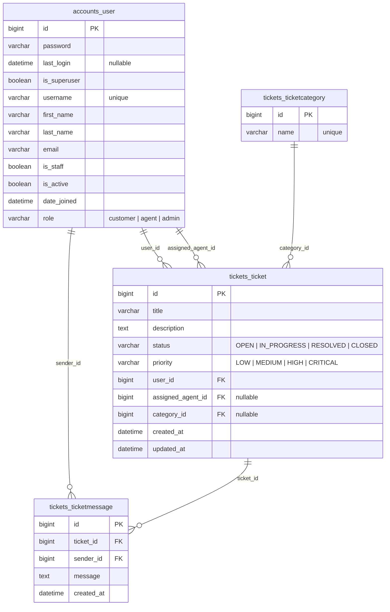

# Professional Ticket System API

A role-based ticket management REST API built with Django and Django REST Framework.

The project includes session-based authentication (Django sessions with HttpOnly cookies), user profiles, a role-based dashboard, ticket CRUD with assignment and status workflows, ticket messages, filtering/search/ordering, pagination, OpenAPI documentation, and automated tests.

## Features

- Custom user model with `customer`, `agent`, and `admin` roles
- User registration, session login/logout, profile, password change
- Admin user management and agent workload listing
- Role-based dashboard overview and metrics
- Ticket CRUD with service-layer business logic
- Ticket categories (read for all authenticated users; write for admins)
- Ticket assignment, status changes, and priority updates
- Ticket messages with role-based visibility
- Ticket statistics endpoint
- Filtering, search, ordering, and pagination
- OpenAPI schema (Swagger UI and ReDoc)
- File and console logging to `debug.log`
- Test suite for `accounts`, `tickets`, and `dashboard` apps

## Tech Stack

- Python 3.10+
- Django 6
- Django REST Framework
- django-filter
- drf-spectacular
- SQLite (local development) / PostgreSQL (production)

## Project Structure

```text
ticketProject/
├── accounts/
│   ├── models.py              # Custom User model
│   ├── serializers.py         # Auth & user serializers
│   ├── views.py               # Registration, profile, admin user management
│   ├── session_views.py       # Session-based login/logout/CSRF views
│   ├── urls.py
│   ├── permissions.py         # Role-based permission classes
│   ├── services/
│   │   └── user_service.py    # User business logic layer
│   ├── management/commands/
│   │   └── seed_data.py       # Database seeding
│   └── tests.py
├── dashboard/
│   ├── views.py               # Overview and agent workload endpoints
│   ├── urls.py
│   ├── serializers.py         # Dashboard response serializers
│   ├── services/
│   │   └── dashboard_service.py  # Metrics aggregation
│   └── tests.py
├── tickets/
│   ├── models.py              # Ticket, TicketCategory, TicketMessage
│   ├── serializers.py         # Ticket/message/category serializer hierarchy
│   ├── views.py               # ViewSets with custom actions
│   ├── permissions.py         # Object-level permissions per role
│   ├── urls.py
│   ├── services/
│   │   ├── ticket_service.py   # Ticket business logic
│   │   └── message_service.py  # Message business logic
│   └── tests.py
├── ticketProject/
│   ├── settings.py            # Django config, session auth, CORS, logging
│   ├── urls.py                # Root URL configuration
│   └── exceptions.py          # Custom exception handler
├── db.sqlite3
├── debug.log
├── manage.py
├── requirements.txt
├── seed_data.py
└── README.md
```

## Architecture

> 📘 Full C4 architecture diagrams (System Context + Container) available in
> [`ARCHITECTURE.md`](ARCHITECTURE.md).

The backend follows a **layered service architecture** separating concerns across four layers:

| Layer | Location | Responsibility |
|-------|----------|----------------|
| **View** | `*/views.py` | HTTP handling, permission enforcement, serializer dispatch |
| **Service** | `*/services/*.py` | Business logic, validation, data aggregation |
| **Model** | `*/models.py` | Data schema, ORM relationships, indexes |
| **Serializer** | `*/serializers.py` | Request/response validation and transformation |

Views are kept thin by delegating to service classes (`TicketService`, `MessageService`, `UserService`, `DashboardService`). This makes business rules testable independently of HTTP concerns.

## Requirements

- Python 3.10+
- pip
- virtualenv or Python `venv`

## Installation

Go to the Django project directory:

```bash
cd ticketProject
```

Create and activate a virtual environment:

```bash
python -m venv .venv
source .venv/bin/activate
```

On Windows PowerShell:

```powershell
python -m venv .venv
.\.venv\Scripts\Activate.ps1
```

Install dependencies:

```bash
pip install -r requirements.txt
```

Apply migrations:

```bash
python manage.py migrate
```

Create a superuser (optional, for Django admin):

```bash
python manage.py createsuperuser
```

Run the development server:

```bash
python manage.py runserver
```

Base URL:

```text
http://127.0.0.1:8000/
```

## Seeding Data

Populate the database with sample users and tickets:

```bash
python manage.py seed_data
```

This creates demo accounts for all three roles (customer, agent, admin) plus sample tickets and messages for testing.

## API Documentation

Interactive docs are available when the server is running:

| URL | Description |
| --- | --- |
| `http://127.0.0.1:8000/api/docs/` | Swagger UI |
| `http://127.0.0.1:8000/api/redoc/` | ReDoc |
| `http://127.0.0.1:8000/api/schema/` | OpenAPI schema (JSON) |

## Authentication

### Session-Based Auth

The system uses **Django session-based authentication** with HttpOnly cookies.

1. The frontend fetches a CSRF token: `GET /api/accounts/csrf/`
2. User logs in: `POST /api/accounts/session/login/` with `username` and `password`
3. Django sets an HttpOnly `sessionid` cookie (inaccessible to JavaScript)
4. All subsequent requests include the session cookie automatically
5. For state-changing requests (POST/PUT/PATCH/DELETE), the frontend sends the CSRF token from the `csrftoken` cookie as the `X-CSRFToken` header

### Why Sessions Instead of JWT?

- **Security**: HttpOnly cookies prevent token theft via XSS
- **Simplicity**: No token refresh logic, no localStorage management
- **Same-origin**: The Vite dev server proxies `/api` requests to Django, keeping cookies same-origin

### Register

```http
POST /api/accounts/register/
Content-Type: application/json
```

```json
{
  "username": "customer1",
  "email": "customer@example.com",
  "password": "StrongPass123!",
  "password2": "StrongPass123!"
}
```

New users default to the `customer` role unless `role` is provided.

### Login

```http
POST /api/accounts/session/login/
Content-Type: application/json
```

```json
{
  "username": "customer1",
  "password": "StrongPass123!"
}
```

Response includes the authenticated user (session cookie is set automatically):

```json
{
  "detail": "Login successful.",
  "user": {
    "id": 1,
    "username": "customer1",
    "email": "customer@example.com",
    "role": "customer",
    "first_name": "",
    "last_name": ""
  }
}
```

### Logout

```http
POST /api/accounts/session/logout/
```

### Get CSRF Token

```http
GET /api/accounts/csrf/
```

## Permissions Model

Access control is enforced at two levels:

### View-Level Permissions

| Permission Class | Access Granted To |
|----------------|-------------------|
| `IsAdmin` | Users with `role = 'admin'` |
| `IsAgent` | Users with `role = 'agent'` |
| `IsCustomer` | Users with `role = 'customer'` |
| `IsAgentOrAdmin` | Users with `role = 'agent'` or `role = 'admin'` |

### Object-Level Permissions (tickets & messages)

| Permission Class | Behavior |
|----------------|----------|
| `IsTicketOwnerOrAgentOrAdmin` | Owner, assigned agent (or unassigned pool for agents), or any admin |
| `CanModifyTicket` | Customer: own OPEN tickets only. Agent: assigned or unassigned. Admin: all. |
| `CanDeleteTicket` | Customer: own OPEN tickets only. Admin: any. Agents: none. |
| `IsMessageOwnerOrTicketParticipant` | Message sender, ticket owner, assigned agent, or admin |

### Service-Layer Business Rules

Additional enforcement in service classes:

- Only **admins** can assign agents to tickets
- Only **agents and admins** can change ticket status or priority
- **Customers** can only message their own tickets
- **Agents** can only message assigned tickets or the unassigned pool

## User Roles

| Role | Access |
| --- | --- |
| `customer` | Own tickets and messages; create tickets; update open tickets; dashboard customer metrics |
| `agent` | Assigned tickets plus unassigned pool; change status/priority; messages on accessible tickets; dashboard agent metrics |
| `admin` | Full ticket and user management; assign agents; categories CRUD; dashboard global metrics |

## API Endpoints

### Accounts

| Method | Endpoint | Description | Auth |
| --- | --- | --- | --- |
| `POST` | `/api/accounts/register/` | Register a new user | No |
| `POST` | `/api/accounts/session/login/` | Log in (creates session) | No |
| `POST` | `/api/accounts/session/logout/` | Log out (destroys session) | Yes |
| `GET` | `/api/accounts/session/` | Check session status | No |
| `GET` | `/api/accounts/csrf/` | Get CSRF token cookie | No |
| `GET` | `/api/accounts/profile/` | Current user profile and stats | Yes |
| `PATCH` | `/api/accounts/profile/update/` | Update profile (`email`, `first_name`, `last_name`) | Yes |
| `POST` | `/api/accounts/change-password/` | Change password | Yes |
| `GET` | `/api/accounts/users/` | List all users | Admin |
| `GET` | `/api/accounts/users/{id}/` | User detail | Admin |
| `PATCH` | `/api/accounts/users/{id}/role/` | Update user role | Admin |
| `GET` | `/api/accounts/agents/available/` | Agents sorted by workload | Admin |

### Dashboard

| Method | Endpoint | Description | Auth |
| --- | --- | --- | --- |
| `GET` | `/api/dashboard/` | Role-based overview (stats, recent activity) | Yes |
| `GET` | `/api/dashboard/agents/` | Per-agent workload breakdown | Admin |

### Tickets

| Method | Endpoint | Description | Auth |
| --- | --- | --- | --- |
| `GET` | `/api/tickets/` | List visible tickets | Yes |
| `POST` | `/api/tickets/` | Create a ticket | Yes |
| `GET` | `/api/tickets/{id}/` | Retrieve a ticket | Yes |
| `PUT` | `/api/tickets/{id}/` | Replace a ticket | Yes |
| `PATCH` | `/api/tickets/{id}/` | Partially update a ticket | Yes |
| `DELETE` | `/api/tickets/{id}/` | Delete a ticket | Yes |
| `GET` | `/api/tickets/statistics/` | Ticket stats for current user | Yes |
| `PATCH` | `/api/tickets/{id}/change_status/` | Change ticket status | Agent/Admin |
| `PATCH` | `/api/tickets/{id}/assign/` | Assign ticket to an agent | Admin |
| `PATCH` | `/api/tickets/{id}/change_priority/` | Change ticket priority | Agent/Admin |

### Categories

| Method | Endpoint | Description | Auth |
| --- | --- | --- | --- |
| `GET` | `/api/categories/` | List categories | Yes |
| `POST` | `/api/categories/` | Create category | Admin |
| `GET` | `/api/categories/{id}/` | Retrieve category | Yes |
| `PUT` | `/api/categories/{id}/` | Replace category | Admin |
| `PATCH` | `/api/categories/{id}/` | Partially update category | Admin |
| `DELETE` | `/api/categories/{id}/` | Delete category | Admin |

### Messages

| Method | Endpoint | Description | Auth |
| --- | --- | --- | --- |
| `GET` | `/api/messages/` | List visible messages (`?ticket=1`) | Yes |
| `POST` | `/api/messages/` | Create ticket message | Yes |
| `GET` | `/api/messages/{id}/` | Retrieve message | Yes |
| `PUT` | `/api/messages/{id}/` | Replace message | Yes |
| `PATCH` | `/api/messages/{id}/` | Partially update message | Yes |
| `DELETE` | `/api/messages/{id}/` | Delete message | Yes |

## Request Examples

### Dashboard Overview

```http
GET /api/dashboard/
```

Response shape depends on role (`customer`, `agent`, or `admin` sections).

### Change Password

```http
POST /api/accounts/change-password/
Content-Type: application/json
```

```json
{
  "old_password": "StrongPass123!",
  "new_password": "NewStrongPass456!",
  "new_password2": "NewStrongPass456!"
}
```

### Create a Category (Admin)

```http
POST /api/categories/
Content-Type: application/json
```

```json
{
  "name": "Technical Support"
}
```

### Create a Ticket

```http
POST /api/tickets/
Content-Type: application/json
```

```json
{
  "title": "Cannot access account",
  "description": "I cannot log in to my account after resetting my password.",
  "priority": "HIGH",
  "category": 1
}
```

### Assign a Ticket

```http
PATCH /api/tickets/1/assign/
Content-Type: application/json
```

```json
{
  "agent_id": 2
}
```

### Change Ticket Status

```http
PATCH /api/tickets/1/change_status/
Content-Type: application/json
```

```json
{
  "status": "IN_PROGRESS"
}
```

### Change Ticket Priority

```http
PATCH /api/tickets/1/change_priority/
Content-Type: application/json
```

```json
{
  "priority": "CRITICAL"
}
```

### Add a Message

```http
POST /api/messages/
Content-Type: application/json
```

```json
{
  "ticket": 1,
  "message": "I checked the issue and need more information."
}
```

## Ticket Fields

| Field | Type | Notes |
| --- | --- | --- |
| `title` | string | Minimum 5 non-space characters |
| `description` | string | Minimum 10 non-space characters |
| `status` | string | Defaults to `OPEN` |
| `priority` | string | Defaults to `MEDIUM` |
| `user` | integer | Read-only, set from authenticated user |
| `assigned_agent` | integer/null | Set via assign action (admin) |
| `category` | integer/null | Optional category ID |
| `created_at` | datetime | Read-only |
| `updated_at` | datetime | Read-only |

## Ticket Status Values

- `OPEN`
- `IN_PROGRESS`
- `RESOLVED`
- `CLOSED`

## Ticket Priority Values

- `LOW`
- `MEDIUM`
- `HIGH`
- `CRITICAL`

## Filtering, Search, Ordering, and Pagination

### Filtering

```http
GET /api/tickets/?status=OPEN
GET /api/tickets/?priority=HIGH
GET /api/tickets/?category=1
GET /api/tickets/?assigned_agent=2
```

### Search

```http
GET /api/tickets/?search=account
```

Search fields: `title`, `description`

### Ordering

```http
GET /api/tickets/?ordering=created_at
GET /api/tickets/?ordering=-created_at
GET /api/tickets/?ordering=priority
```

### Pagination

Default page size is `10`.

```http
GET /api/tickets/?page=2
```

## Running Tests

Run the full test suite:

```bash
python manage.py test accounts.tests tickets.tests dashboard.tests
```

Run tests per app:

```bash
python manage.py test accounts.tests
python manage.py test tickets.tests
python manage.py test dashboard.tests
```

Current coverage (69 tests):

| App | Tests | Areas covered |
| --- | --- | --- |
| `accounts` | 23 | UserService, register, login, profile, password, admin user APIs |
| `tickets` | 32 | Ticket/Message services, CRUD, permissions, categories, custom actions |
| `dashboard` | 14 | DashboardService, overview, agent workload |

## Admin Panel

```text
http://127.0.0.1:8000/admin/
```

Create a superuser with:

```bash
python manage.py createsuperuser
```

## Database Schema

The project defines **4 custom tables** plus Django's built-in auth tables (`auth_group`, `auth_permission`).

### `accounts_user` — Custom user model

| Column | Type | Constraints |
|--------|------|-------------|
| `id` | `BIGINT` | `PK`, auto-increment |
| `password` | `VARCHAR(128)` | not null |
| `last_login` | `DATETIME` | nullable |
| `is_superuser` | `BOOLEAN` | not null |
| `username` | `VARCHAR(150)` | `UNIQUE`, not null |
| `first_name` | `VARCHAR(150)` | nullable |
| `last_name` | `VARCHAR(150)` | nullable |
| `email` | `VARCHAR(254)` | nullable |
| `is_staff` | `BOOLEAN` | not null |
| `is_active` | `BOOLEAN` | not null, default `true` |
| `date_joined` | `DATETIME` | not null |
| `role` | `VARCHAR(20)` | not null, `CHECK(role IN ('customer','agent','admin'))`, default `'customer'` |

Inherits Django's built-in Many-to-Many: `groups` → `auth_group`, `user_permissions` → `auth_permission`.

### `tickets_ticketcategory` — Ticket categories

| Column | Type | Constraints |
|--------|------|-------------|
| `id` | `BIGINT` | `PK`, auto-increment |
| `name` | `VARCHAR(100)` | `UNIQUE`, not null |

### `tickets_ticket` — Support tickets

| Column | Type | Constraints |
|--------|------|-------------|
| `id` | `BIGINT` | `PK`, auto-increment |
| `title` | `VARCHAR(255)` | not null |
| `description` | `TEXT` | not null |
| `status` | `VARCHAR(20)` | not null, default `'OPEN'`, choices: OPEN/IN_PROGRESS/RESOLVED/CLOSED |
| `priority` | `VARCHAR(20)` | not null, default `'MEDIUM'`, choices: LOW/MEDIUM/HIGH/CRITICAL |
| `user_id` | `BIGINT` | `FK → accounts_user.id`, not null, `ON DELETE CASCADE` |
| `assigned_agent_id` | `BIGINT` | `FK → accounts_user.id`, nullable, `ON DELETE SET NULL` |
| `category_id` | `BIGINT` | `FK → tickets_ticketcategory.id`, nullable, `ON DELETE SET NULL` |
| `created_at` | `DATETIME` | not null, auto-set on create |
| `updated_at` | `DATETIME` | not null, auto-updated |

**Indexes:** `status`, `priority`, `created_at`

### `tickets_ticketmessage` — Messages on a ticket

| Column | Type | Constraints |
|--------|------|-------------|
| `id` | `BIGINT` | `PK`, auto-increment |
| `ticket_id` | `BIGINT` | `FK → tickets_ticket.id`, not null, `ON DELETE CASCADE` |
| `sender_id` | `BIGINT` | `FK → accounts_user.id`, not null, `ON DELETE CASCADE` |
| `message` | `TEXT` | not null |
| `created_at` | `DATETIME` | not null, auto-set on create |

### Entity Relationships

| Relationship | Type |
|-------------|------|
| `accounts_user` → `tickets_ticket` (via `user_id`) | One-to-Many |
| `accounts_user` → `tickets_ticket` (via `assigned_agent_id`) | One-to-Many |
| `accounts_user` → `tickets_ticketmessage` (via `sender_id`) | One-to-Many |
| `tickets_ticketcategory` → `tickets_ticket` (via `category_id`) | One-to-Many |
| `tickets_ticket` → `tickets_ticketmessage` (via `ticket_id`) | One-to-Many |

### ER Diagram



## Service Layer Reference

| Service Class | Location | Key Methods |
|--------------|----------|-------------|
| `UserService` | `accounts/services/user_service.py` | `create_user()`, `get_user_profile()`, `get_available_agents()`, `update_user_role()` |
| `TicketService` | `tickets/services/ticket_service.py` | `get_tickets_for_user()`, `create_ticket()`, `change_ticket_status()`, `assign_agent_to_ticket()`, `change_ticket_priority()`, `get_ticket_statistics()` |
| `MessageService` | `tickets/services/message_service.py` | `get_messages_for_user()`, `create_message()`, `validate_message_access()` |
| `DashboardService` | `dashboard/services/dashboard_service.py` | `get_overview()`, `get_agent_workload()` |

## Environment Variables

| Variable | Description | Default |
| --- | --- | --- |
| `DJANGO_SECRET_KEY` | Secret key (REQUIRED in production) | Dev fallback |
| `DJANGO_DEBUG` | `True` or `False` | `True` |
| `DJANGO_ALLOWED_HOSTS` | Comma-separated hosts | Empty |
| `DATABASE_URL` | PostgreSQL connection string (optional) | SQLite |

Logging is configured to output to both `debug.log` (file) and console at `INFO` level.

## Development Notes

- Custom user model: `accounts.User`
- Default database: SQLite (`db.sqlite3`)
- Auth: Django session-based (HttpOnly cookies)
- Logs: `debug.log` (file) and console
- Service layers: `accounts`, `tickets`, `dashboard`
- Object-level permissions on tickets and messages
- CSRF protection: enabled; frontend must send `X-CSRFToken` header for unsafe methods

## Production Checklist

- [ ] Set `DJANGO_SECRET_KEY` from a secure source
- [ ] Set `DJANGO_DEBUG=False`
- [ ] Configure `DJANGO_ALLOWED_HOSTS`
- [ ] Configure `CSRF_TRUSTED_ORIGINS` with your frontend domain
- [ ] Use PostgreSQL or another production database
- [ ] Update `CORS_ALLOWED_ORIGINS` in settings.py for your frontend domain
- [ ] Configure static/media file serving
- [ ] Add Docker / reverse proxy / HTTPS
- [ ] Set up CI/CD running `python manage.py test`

## Suggested Next Steps

- Add CI pipeline (GitHub Actions) for tests on every push
- Add rate limiting and throttling
- Add email notifications for ticket updates
- Replace SQLite with PostgreSQL for production
- Add Redis and Celery for async tasks
